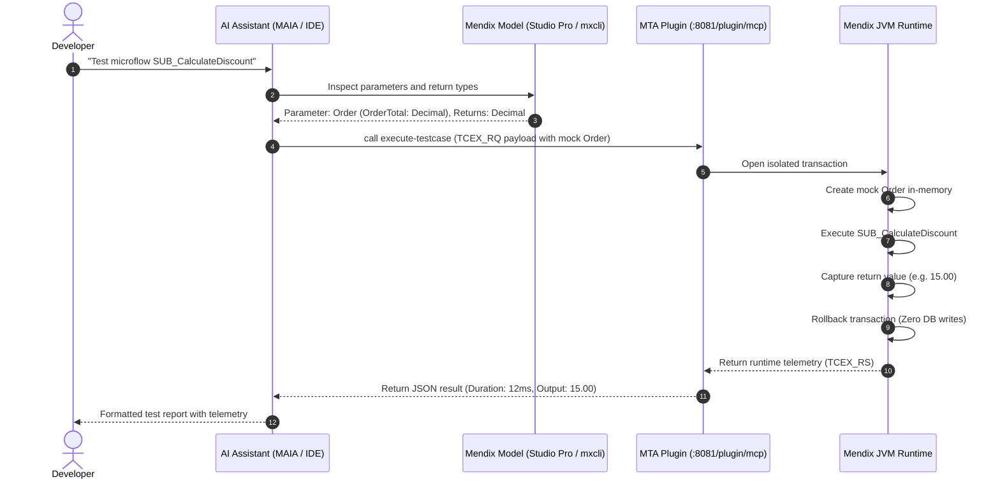

# MTA Exploratory Free Edition Setup Guide

Welcome to the **Menditect Test Automation (MTA) Exploratory Free Edition**.

This guide provides step-by-step instructions to configure and run AI-assisted exploratory testing on your local Mendix application **without requiring a paid MTA Cloud license**.

MTA Exploratory provides in-memory test execution directly inside your running Mendix Java Virtual Machine (JVM). When your AI assistant executes an exploratory test:
1. It creates test objects and parameters in-memory.
2. It executes your target microflows with isolated test payloads.
3. It automatically rolls back database transactions (`RollbackTcseAfterExecution: Yes`), keeping your application data clean.
4. It analyzes runtime telemetry (variable values, return data, execution times, and rule evaluations) and presents immediate results.

---

## Choose Your Setup Path

The **MTA Runtime Plugin** is required for all setups. You can choose how your AI assistant interacts with your Mendix application:

```
                                  ┌──────────────────────────────────────────────┐
                                  │      COMMON PREREQUISITE: MTA PLUGIN         │
                                  │   Install & configure in Mendix Studio Pro   │
                                  └──────────────────────┬───────────────────────┘
                                                         │
                        ┌────────────────────────────────┴────────────────────────────────┐
                        │                                                                 │
                        ▼                                                                 ▼
      ┌───────────────────────────────────┐                             ┌───────────────────────────────────┐
      │             VARIANT 1             │                             │             VARIANT 2             │
      │            Mendix MAIA            │                             │      Agentic Test Workspace       │
      │      (Studio Pro Built-in         │                             │  (External AI IDEs: Cursor,       │
      │       Mendix AI Assistant)        │                             │   VS Code, Antigravity, Claude)   │
      └───────────────────────────────────┘                             └───────────────────────────────────┘
```

| Feature / Aspect | Variant 1: Mendix MAIA | Variant 2: Agentic Test Workspace |
| :--- | :--- | :--- |
| **Primary Environment** | Inside Mendix Studio Pro (11.12+) | External AI IDE (Cursor, VS Code, Antigravity, Claude Code) |
| **Model Inspection** | Live native Studio Pro model context | Headless and offline via `mxcli` + local SQLite `catalog.db` |
| **Testing Skills Location** | Marketplace module: `Menditect_AgenticTestSkills` | Project or workspace `./skills/` directory |
| **Git Impact on Mendix** | Skills module committed to Mendix repository | **Zero impact** (isolated in dedicated tools workspace) |
| **Best For** | Developers working entirely within Mendix Studio Pro | Developers using modern AI coding IDEs and multi-agent setups |

---

## Common Step: Install and Configure the MTA Plugin in Studio Pro

The MTA Plugin embeds a lightweight, secure Model Context Protocol (MCP) server directly inside your running Mendix application. This step is identical for both variants.

### 1. Download and Import the MTA Plugin Module
1. Open the private marketplace link provided in your welcome email:
   * **[MTA Plugin with MCP Server (Marketplace Component 305699)](https://marketplace.mendix.com/link/component/305699)**
2. Add it to your Mendix project in Studio Pro (via **App > Add module from file...** or Marketplace).
3. If prompted, ensure standard module dependencies (such as `CommunityCommons`) are updated.

> [!NOTE]
> **Early Access vs. Public Release:** The private marketplace component **MTA Plugin with MCP Server** (305699) is currently used for the Early Access Program. On final release, the MTA Plugin MCP server will be officially included and released in the standard public [Menditect Test Automation Plugin component (Marketplace Component 214717)](https://marketplace.mendix.com/link/component/214717).

### 2. Configure MTA Plugin Constants
In Mendix Studio Pro App Explorer, open `App > Marketplace modules > MtaPluginModule > Constants` (or configure them under `Settings > Configurations > Edit > Constants`):

| Constant Name | Value | Description and Rationale |
| :--- | :--- | :--- |
| **`MtaPluginModule.ApplicationInstanceToken`** | `{YOUR_UNIQUE_TOKEN}` | Paste the personal token provided in your Menditect welcome email. |
| **`MtaPluginModule.ConnectionMethod`** | `AfterStartup` | Connects the plugin automatically whenever the application starts. |
| **`MtaPluginModule.EnableMcpServer`** | `True` | Activates the local `/plugin/mcp` endpoint for your AI assistant. |
| **`MtaPluginModule.MTAConnectionUrl`** | `wss://services.menditect.com` | The Menditect connection WebSocket gateway URL. |
| **`MtaPluginModule.MTAConnectionUsername`** | `MTAConnectionUser` | Default username for the plugin connection. |
| **`MtaPluginModule.MTAConnectionPassword`** | `c0Nn3cT-mTa-PlUg1n!` | Default password for the connection gateway. |
| **`MtaPluginModule.McpServerAccessToken`** | *(Choose your own secret key)* | e.g. `MySecretToken123`. This secret token protects your local MCP endpoint from unauthorized access. |

> [!IMPORTANT]
> Make note of the secret value you enter for **`MtaPluginModule.McpServerAccessToken`**. You will provide this token to your AI assistant / workspace configuration.

### 3. Verify Startup Microflow
If your project already defines an *After Startup* microflow under **App > Settings > Runtime**:
* Open your existing After Startup microflow.
* Add a microflow call activity to execute `MtaPluginModule.AfterStartup`.

### 4. Start Your Application Locally
* Press **F5** (or click **Run Locally**) in Studio Pro.
* Ensure the application starts cleanly. The MTA plugin is now actively listening for MCP requests on `http://localhost:8081/plugin/mcp` (or your application's custom runtime port).

---

## Variant 1: Setup in Mendix MAIA (Studio Pro AI Assistant)

Use this setup to work **entirely inside Mendix Studio Pro (11.12+)** using the built-in **Mendix AI Assistant (MAIA)**.

### 1. Prerequisites
* **Mendix Studio Pro 11.12 or higher** with MAIA enabled.
* The **MTA Plugin** installed and running (from the Common Step).

### 2. Download the Menditect Agentic Test Skills Module
1. In Mendix Studio Pro, open the **Marketplace**.
2. Search for and download the **`Menditect_AgenticTestSkills`** module.
3. Importing this module automatically places the official Menditect testing skills into your project's module skills directory:
   `skillssource/_modules/menditect_agentictestskills/`

> [!NOTE]
> If importing skills manually or syncing via Git, ensure the skills are located in `skillssource/_modules/menditect_agentictestskills/` within your Mendix project directory.

### 3. Configure MAIA Context and Directives (`AGENTS.md`)
MAIA reads its custom project instructions exclusively from an **`AGENTS.md`** file located in the root directory of your Mendix project.

1. Check your Mendix project root folder for `AGENTS.md`:
   * **If `AGENTS.md` does not exist:** Create a new text file named `AGENTS.md` in your Mendix project root.
   * **If `AGENTS.md` already exists:** Open it and **append** the following block to the bottom of the file (preserving any existing rules or instructions).
2. Add the Menditect operational directive block:

```markdown
# Menditect Architecture Setup
- **CRITICAL OPERATIONAL COMMAND:** Always execute testing tasks using the core rules defined in the module: [Menditect_AgenticTestSkills].
- **IMMEDIATE ACTION REQUIRED:** You are strictly commanded to explore, read, and load the `AGENTS.md` and context of the [Menditect_AgenticTestSkills] module before answering testing prompts.
- **NATIVE MCP TOOL EXECUTION MANDATE:** You MUST ALWAYS use the MTA Plugin MCP tool (`MTA_plugin.execute-testcase`) for all in-memory exploratory test executions.
- **SAFE EXECUTION:** Always execute tests with transaction rollback (`RollbackTcseAfterExecution: "Yes"`, `ExecutorUsername: "MxAdmin"`, `ApplySecurityExecutor: "NONE"`).
```

> [!TIP]
> **Custom Execution User:** By default, test execution runs under the `MxAdmin` user context. If `MxAdmin` is not present in your Mendix app's user database, you can specify a different existing administrator or test username (e.g. `ExecutorUsername: "Admin"` or `ExecutorUsername: "TestUser"`) in your `AGENTS.md` directives.

### 4. Connect MAIA to the Local MTA Plugin MCP Server
Configure MAIA's MCP tool settings in Studio Pro (or within your environment MCP configuration):

* **Server Name:** `MTA_plugin`
* **Transport:** `HTTP / SSE`
* **URL:** `http://localhost:8081/plugin/mcp` *(or `http://localhost:[YourPort]/plugin/mcp`)*
* **Headers:** 
  ```json
  {
    "Authorization": "Bearer MySecretToken123"
  }
  ```
  *(Replace `MySecretToken123` with the exact value set in `MtaPluginModule.McpServerAccessToken`)*

### 5. Execute an Exploratory Test in MAIA
1. Ensure your Mendix app is running (**F5**).
2. Open the **MAIA Chat** panel inside Mendix Studio Pro.
3. Prompt MAIA:

```text
Using the Menditect Agentic Test Skills module, execute an exploratory test for microflow MyModule.SUB_CalculateDiscount on my running app. Verify boundary conditions and check return values.
```

4. **MAIA Execution Process:**
   * MAIA reads the microflow directly from your active Studio Pro model.
   * It composes the in-memory test payload (`TCEX_RQ`) following the patterns in `Menditect_AgenticTestSkills`.
   * It sends the request to the local MTA Plugin MCP server (`execute-testcase`).
   * The microflow executes in the JVM and rolls back immediately.
   * MAIA displays the execution telemetry, step durations, and verified return values in the chat.

---

## Variant 2: Setup via Agentic Test Workspace (External AI IDE)

Use this setup to write and run tests using external AI IDEs such as **Cursor**, **VS Code (GitHub Copilot / Cline)**, **Google Antigravity / Gemini**, or **Claude Code**.

The **[agentic-test-workspace](https://github.com/Menditect/agentic-test-workspace/blob/main/README.md)** is a pre-configured tools workspace that orchestrates Menditect testing skills, offline model inspection, and local MCP tool bridging for AI coding assistants.

### Why Use the Agentic Test Workspace?
* **Multi-IDE Automation:** Automatically configures MCP tool definitions, security permissions, and agent directives for Cursor (`.cursor/mcp.json`), VS Code (`.vscode/mcp.json`), Claude Code (`.claude/settings.json`), and Google Antigravity (`mcp_config.json`) with zero manual JSON editing.
* **Offline Model Search & AST Analysis (`mxcli`):** Includes a built-in Mendix model indexer (`mxcli`) that converts your `.mpr` project file into an optimized local SQLite catalog (`.mxcli/catalog.db`). This allows AI assistants to perform sub-second microflow lookups, trace callers/callees, and inspect domain models completely offline.
* **Zero Git Clutter:** The dedicated tools workspace operates in an isolated directory alongside your Mendix project, keeping your core Mendix Git repository completely clean of test scripts, logs, and local tokens.
* **Dynamic MCP Token Bridging:** Embeds a local proxy (`mta-proxy.js`) that connects stdio-based AI IDEs to the running Mendix runtime's HTTP MCP endpoint, dynamically reloading tokens from `.env` without requiring IDE restarts.

For in-depth architecture details and command references, see the **[agentic-test-workspace README](https://github.com/Menditect/agentic-test-workspace/blob/main/README.md)**.

### 1. Prerequisites
* **Node.js (v18+)** installed.
* **Git** installed.

### 2. Clone the Workspace Template
Open your terminal (PowerShell, Command Prompt, or Bash) and run:

```bash
# 1. Create a workspace folder
mkdir C:\projects\mta-workspace
cd C:\projects\mta-workspace

# 2. Clone the workspace template
git clone https://github.com/Menditect/agentic-test-workspace.git

# 3. Enter the tools directory
cd agentic-test-workspace
```

### 3. Run the Setup Wizard
Run the interactive setup script:

```bash
npm run setup
```

Follow the prompts step-by-step:

1. **Accept Disclaimer:** Press **Enter** to accept `y`.
2. **Workspace Option:** Choose `[1] Dedicated Tools Workspace (Recommended)` to keep your Mendix project repository clean.
3. **Local Mendix App Path:** Enter the path to your Mendix project (e.g. `C:\Users\YourName\Mendix\MyApp`). The wizard will detect your `.mpr` file and Mendix version automatically.
4. **Model Inspection Source:** Select `[1] mxcli (recommended)`. This allows the AI to inspect microflows and domain models offline.
5. **Project Search Index:** Select `[1] Fast (recommended)` to compile the SQLite catalog (`.mxcli/catalog.db`) in seconds.
6. **MTA Application Instances (Cloud Execution):** When asked *"Do you have an MTA Application Instance to configure? (y/n)"*, enter `n`. *(Exploratory testing runs locally and does not require cloud instances).*
7. **Application Name:** Press **Enter** to accept the detected project name.
8. **MTA URL:** Default is `http://services.menditect.com`. *(Note: For free exploratory users, the cloud MTA URL is not relevant because all testing runs locally on your machine. You can safely press **Enter** to accept the default or leave it empty).*
9. **Identification token for a service account:** **Press Enter to SKIP (leave blank).** *(You do not need an MTA Cloud license or service account token for exploratory testing).*
10. **App Under Test Plugin URL:** Press **Enter** to accept `http://localhost:8081/plugin/mcp` (or enter your custom port if different).
11. **App Under Test Plugin Token:** Enter `Bearer ` followed by the secret token you chose in Studio Pro for `MtaPluginModule.McpServerAccessToken` (e.g. `Bearer MySecretToken123`).

### 4. Verify the Setup
Make sure your Mendix application is running in Studio Pro (**F5**), then execute:

```bash
npm run verify
```

The tool will confirm:
* `mta_config.json` and `.env` are properly structured.
* `mxcli` offline model inspection is active.
* Local `MTA_plugin` MCP endpoint is reachable and authenticated.

### 5. Open Your AI IDE and Execute Your First Test
1. Open the parent workspace directory (e.g. `C:\projects\mta-workspace`) in **Cursor**, **VS Code**, or **Antigravity** (or run `claude` in that directory).
2. All MCP configurations (`.cursor/mcp.json`, `.vscode/mcp.json`, `.claude/settings.json`) and agent directives (`AGENTS.md`) are automatically loaded.
3. Prompt your assistant in the chat:

```text
Read mta_config.json and .env in this workspace.
Please inspect the microflow MyModule.SUB_CalculateDiscount using mxcli, 
and execute an exploratory test on my running app using the MTA_plugin tool.
```

---

## How Exploratory Test Execution Works

Regardless of whether you use **Variant 1 (MAIA)** or **Variant 2 (Agentic Workspace)**, the underlying exploratory execution engine operates under the same protocol:



### Key Request Safeguards in `TCEX_RQ`
* **`ExecutorUsername: "MxAdmin"`**: Provides the execution user context to the Mendix runtime. *(Note: If `MxAdmin` is not present in your Mendix user database, you can specify a different username—such as `Admin` or a designated test user—in your `AGENTS.md` directives).*
* **`ApplySecurityExecutor: "NONE"`**: Allows isolated unit testing without requiring active browser session logins.
* **`RollbackTcseAfterExecution: "Yes"`**: Guarantees test operations never leave dirty data in your local database.
* **`TCEX_RQ_AttributeValueRun`**: Injects mock attributes directly into memory before executing the microflow.

---

## Maintenance and Useful Commands Reference

| Task | Variant 1: MAIA | Variant 2: Agentic Workspace |
| :--- | :--- | :--- |
| **Verify Setup** | Check MAIA MCP server status indicator in Studio Pro | Run `npm run verify` in terminal |
| **Update Skills** | Update `Menditect_AgenticTestSkills` via Marketplace | Run `npm run update:skills` |
| **Re-index Model** | Automatic (MAIA reads live Studio Pro model) | Run `./mxcli -c "REFRESH CATALOG FULL FORCE;"` |
| **Check for Tool Updates** | Check Studio Pro Marketplace updates | Run `npm run update:check` |

---

## Troubleshooting

### 1. HTTP 401 Unauthorized from `MTA_plugin`
* **Cause:** The MCP access token configured in your IDE / MAIA does not match Studio Pro.
* **Solution:** Ensure `PLUGIN_MCP_TOKEN` in your `.env` (or MAIA MCP header) is set to `Bearer <YourToken>`, matching `MtaPluginModule.McpServerAccessToken`.

### 2. Connection Refused (`http://localhost:8081/plugin/mcp`)
* **Cause:** The Mendix application is not running or the MCP server is disabled.
* **Solution:**
  1. Make sure your app is running in Studio Pro (**F5**).
  2. Verify that constant `MtaPluginModule.EnableMcpServer` is set to `True`.
  3. If your Mendix app runs on a custom port (e.g. `8080`), change the port in your URL to `http://localhost:8080/plugin/mcp`.

### 3. Java Exception: `Executor Username or Executor UserRoles need to be given`
* **Cause:** The execution payload omitted the execution user, or the configured user does not exist in the database.
* **Solution:** The Menditect skills default to `"ExecutorUsername": "MxAdmin"` and `"ApplySecurityExecutor": "NONE"`. If `MxAdmin` is not present in your application, set your project's active administrator or test user (e.g. `ExecutorUsername: "Admin"`) in your `AGENTS.md` file.

### 4. Java Runtime Errors after installing / updating MTA Plugin
* **Cause:** Leftover or duplicate MTA Plugin `.jar` files in the project library folder after importing or updating the module.
* **Solution:**
  1. Open your local Mendix project directory in your file explorer.
  2. Navigate to the `userlib/` directory and remove any older or conflicting MTA Plugin `.jar` files (e.g., `mta-plugin-*.jar`).
  3. In Mendix Studio Pro, go to **App > Clean Deployment Directory** (or **Project > Clean Deployment Directory**).
  4. Restart and run your Mendix application from Studio Pro (**F5**).

---

*Note: Upgrading to cloud automated test suites: If you subscribe to a full MTA license, simply update your configuration with your MTA Service Account Token to unlock cloud test suites and CI/CD execution.*
