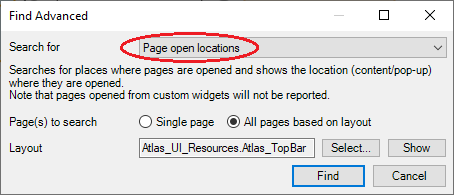

# Prepare Mendix project

To prepare the Mendix project for MTA, it is advisable to check for microflows that open a page.  
If you want to test a microflow that opens a page, you must set a Return value in that microflow, returning the object that is passed to the page.

To find all microflows that have a “show page” activity, open Mendix Studio Pro, go to Edit → Find Advanced and select the following options:  

- Choose an optional layout that is used in the project and Mendix will give you a list of “find results”. 
- Filter the find results by only showing results of the type “microflows”. 
- Check all the microflows of the “find results” and add return types for microflows you want to include in testing. 
- Repeat this for all page layouts in use. 

This process saves time if completed before configuring MTA.

:::note A Few Notes
- Only follow these steps for the microflows that you actually want to test.
- If pages are called *without* Page Parameters, no changes are needed.
- If pages are called with *multiple* Page Parameters, you have to fill these using the output of a [Create](../../../Teststep/create) or [Retrieve](../../../Teststep/retrieve) teststep.
:::

## Feedback?
Missing anything? [Let us know!](mailto:support@menditect.com)

Last updated 30 June 2025