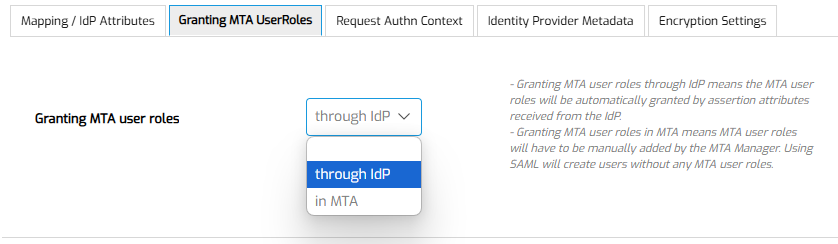

# Configure MTA to use SAML SSO

## Definition

This document describes how to configure MTA to use SAML SSO to authenticate users logging into MTA, instead of using Local Accounts.

This document does *not* describe how to test an application using SSO authentication. Please read [this howto](../design-tests/test-without-local-account) for that.

## Enable SAML SSO
The SAML20 module, and the necessary dependency modules, have been imported into MTA. 

If you have a on-premises license, please follow the [run mta on premises](../../installation#saml-sso) howto for SAML SSO first.

If Menditect is hosting MTA for you, please [contact support](mailto:support@menditect.com) to have it enabled. 


## Configure SAML SSO

The basic configuration for SAML SSO is the same for all Identity Providers and described in the Mendix documentation. The current location of the relevant documentation page is here: https://docs.mendix.com/appstore/modules/saml/

This configuration has to be done when logged in with the MTA Manager role in MTA.

Use these settings:

| IdP configuration                            |                                                                                         |
| -------------------------------------------- | --------------------------------------------------------------------------------------- |
| Alias                                        | *[Name your configuration]*                                                             |
| Response protocol binding                    | POST_BINDING                                                                            |
| Use AssertionConsumerService Concept         | No                                                                                      |
| Assertion consumer service index             | 0                                                                                       |
| Read IDP metadata from URL                   | No                                                                                      |
| Preferred entity descriptor                  | *[Will be filled automatically, after uploading the .xml file]*                         |
| Authentication context                       | *[Use default configuration]*                                                           |
| Identifying assertion type                   | Use Name ID                                                                             |
| Entity where the user is to be found         | Administration.Account                                                                  |
| Attribute where the user principal is stored | FullName                                                                                |
| Allow the module to create users             | Yes                                                                                     |
| Use Custom logic for user provisioning       | Yes                                                                                     |
| Custom microflow                             | SSOConfigModule.CustomUserProvisioning                                                  |
| Encryption settings                          | *[Choose your preference, uploading a keypair is not required to enable this setting.]* |


## User provisioning

MTA uses user provisioning logic like any other Mendix App implementing SAML. It is not possible to change this logic.

The SAML20 module will create an Account if a user can be authenticated by the IdP. However, by default, the Account will have no User Roles. 

**Use below setting to indicate if User Roles are set in MTA by an MTA Manager, or by your IdP:**


Configure your IdP to use a SAML "Attribute" Assertion, as follows.

```
- There must be at least one assertion attribute with the name "MTA_UserRole"
- if the value is 'Administrator', then the 'Administrator' role will be assigned;
- if the value is 'MTAManager', then the 'MTAManager' role will be assigned;
- if the value is 'Tester', then the 'Tester' role will be assigned;
- if the value is 'CiCdApiUser', then the 'CiCdApiUser' role will be assigned;
```

When assigning the 'Administrator' role, MTA must be configured to [run on-premises](../../installation).

More about User Roles can be found in the [Manage Accounts howto](manage-accounts#mta-user-roles).

## Feedback?
Missing anything? [Let us know!](mailto:support@menditect.com)

Last updated 6 May 2025

