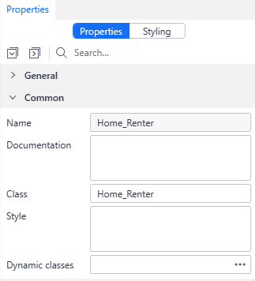

# Prepare for a Frontend test with MTA

## Purpose 

This document describes how to prepare your Mendix model for a Frontend Test in MTA.

Make sure to first [connect Playwright to MTA](../connect-mta/connect-playwright-to-mta).

## Preparations

In order to identify a Mendix Page, it is necessary to fill in the [Page class on the Mendix Page in Studio Pro](https://docs.mendix.com/refguide/common-widget-properties/#class). 

If there is already a Page class filled in, it is possible to add another class name, separated with a `Space`.

:::info Recommended
Assign the same class name on the Page as the Page's Title. 
:::

## Next step for Frontend Testing

[Design Frontend test in MTA](../design-tests/frontend-test-with-mta)

## Feedback?
Missing anything? [Let us know!](mailto:support@menditect.com)

Last updated 15 september 2025