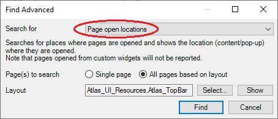

# Prepare Mendix project

## Add Page Classes

This preparation step is required for **Frontend testing**.

In order to identify a [Mendix Page](../../../mta/mendix-page), it is necessary to fill in the [Page class on the Mendix Page in Studio Pro](https://docs.mendix.com/refguide/common-widget-properties/#class). 

If there is already a Page class filled in, it is possible to add another class name, separated with a `Space`.

:::note A Few Notes
- It is recommended to use the same name for the Class as for the Page.
- It is recommended to [Export a list of Mendix Pages](../../../mta/mendix-page#view-or-export-page-usage) (with their Classes) from MTA
:::

## Set Microflow Return values

This preparation step is recommended for **Backend testing** (microflow testing).

If a [Microflow](../../../mta/mendix-microflow) creates data that you want to use as input for your test, it is recommended to pass this data as a Return value.

For example, if a Microflow opens a [Page](../../../mta/mendix-page), you can set a Return value in that microflow, so the Object that is passed to the page, can be used in MTA.

To find all microflows that have a “show page” activity, open Mendix Studio Pro, go to Edit → Find Advanced and select the following options:  

- Choose an optional layout that is used in the project and Mendix will give you a list of “find results”. 
- Filter the find results by only showing results of the type “microflows”. 
- Check all the microflows of the “find results” and add return types for microflows you want to include in testing. 
- Repeat this for all page layouts in use. 

:::note A Few Notes
- Only follow these steps for the microflows that you actually want to test.
- If pages are called *without* Page Parameters, no changes are needed.
- If pages are called with *multiple* Page Parameters, you have to fill these using the output of a [Create](../../../mta/Teststep/create) or [Retrieve](../../../mta/Teststep/retrieve) teststep.
:::

## Feedback?
Missing anything? [Let us know!](mailto:support@menditect.com)

Last updated 30 June 2025