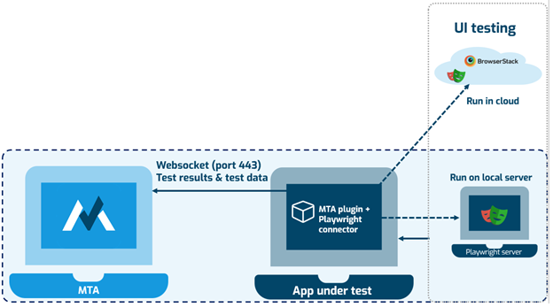

# Test the UI with MTA

This section describes how to create a frontend test in MTA, by adding the prerequisite modules to a Mendix project.

:::note Playwright
Menditect uses the Playwright runtime to execute these frontend tests. 
Playwright is a library with which you can locate elements on a web page and execute actions on these elements.
See https://playwright.dev/java/ for the relevant documentation.
:::

## Prerequisites

Download below modules from the Mendix marketplace to enable frontend testing.

Note: the Playwright Connector and Starter Kit modules are still in Beta. Menditect distributes these modules but does not offer support for it's use. If you want access to these modules, please [contact support](mailto:support@menditect.com).
- The Playwright Connector: https://marketplace.mendix.com/link/component/235323 
- The Playwright Starter Kit: https://marketplace.mendix.com/link/component/235327 
- An Example App for testing Mendix Widgets with Playwright: https://marketplace.mendix.com/link/component/235973
- The [MTA Plugin](../connect-mta/import-plugin) 

:::tip Separate from Test App
For this how-to, we have imported these modules in the same Mendix App, as the one under test. 
It is however possible to import the prerequisite modules in a separate App. 
Documentation for this setup will be added in the future.
:::

### Playwright Connector

The Playwright Connector makes it possible to define and run a frontend test from any Mendix App. It the App to connect to the Playwright server, based on specified connection settings, and execute the test. When executing a UI test, Playwright starts and hosts its own browser. This can be Chromium, Firefox or Webkit. In order to do this, Playwright needs to load required dependencies and, therefore, it needs the right permissions on the host server. In the image below, you can see how Playwright can be hosted on remote servers, either in the cloud or on a local server.

The Playwright Connector includes Locator microflows to find elements on a webpage, and Action microflows to click on elements, fill them with text, or select a value. Therefore it can be used to test *any* webapplication, not just Mendix Apps. Locator and Action microflows in the Playwright Connector can be defined and executed from MTA.

### Starter Kit

The Starter Kit is meant specifically to define and run frontend tests for Mendix apps. This starter kit contains
- Reusable Locator and Action microflows to test Mendix Platform Supported Widgets;
- A Page showing Results from executed tests.

A few notes about the Starter Kit:
- The Starter Kit assumes that the default texts for elements is used as defined in a US-English Mendix project. Other languages are not (yet) supported.
- [React-enabled projects](https://docs.mendix.com/refguide/mendix-client/react/) can be tested by setting the Constant IsUsingReactClient to True.
- Although more Widgets will be added as supported in the Starter Kit, any changes made in the future can break Locating a Widget correctly.

#### Structure

`_Private`
This folder contains generic Locator microflows that are used internally by the Starter Kit to uniquely identify and locate a Widget on a Mendix Page. These microflows should not be called directly. Specific Locator microflows must be created for each Mendix Page, bespoke to your Mendix App. For now, use the [Example App](#example-app) to build Page-specific Locator microflows. In the future, Menditect will be able to generate these microflows based on the Page structure.

`_Use_Me / TestResults`
This folder contains a Page that shows stored files (Screenshots, Snapshots and Trace Files) after executing a test where Tracing was enabled. For now, these files are stored in the Mendix App where the Playwright Connector module is imported. In the future, Test Results will be stored in MTA.

`_Use_Me / WidgetActions`
This folder contains Action microflows for Mendix Widgets. 

## Get started

- Start by importing the Playwright Connector. This module **requires the playwright driver bundle** jar file in your userlib directory if you want to [run Playwright on your local machine](#setup-local-testing). Download the jar file here: https://repo1.maven.org/maven2/com/microsoft/playwright/driver-bundle/1.49.0/driver-bundle-1.49.0.jar
- Download the Starter Kit module to start testing the most common Mendix Widgets.
- Add both the Module Roles to the project's User Roles.
- Add the TestResultFiles page to the Navigation for the User Role that will be evaluating executed frontend Tests.
- Optionally add the Overview page to the Navigation if you plan to use the examples in the Starter Kit as inspiration to start building your own frontend test. 

:::info Recommended
It is recommended for first-time users to use the Example App to get started.
:::

## Test structure

Each frontend test has the same basic structure:
- Setup
- Locators and Actions
- Teardown

### Setup (local testing)

Playwright can be hosted locally with the Mendix App running in Studio Pro (e.g. localhost). For this, you only need to add the necessary jar file (driver-bundle.jar) to the /userlib folder of the Mendix project. If this jar file is added to the Mendix project and the app is deployed to a local server that allows Playwright to load the dependencies it needs, this is sufficient for executing the Test Cases. Separate hosting of the Playwright browsers is not needed then. However, if the jar-file is not added and/or the local server is also limited in the access it requires for Playwright to load its dependencies, it is needed to host a Playwright server elsewhere. 

:::note Licensed Mendix node not supported
The Mendix Cloud currently does not allow for third party frameworks, like Playwright, to load its own dependencies. This is why it is currently not possible to use UI testing in MTA when the app under test is hosted in the Mendix Cloud.
:::

These microflows are called in order to setup a locally executed frontend test:

| Microflow     | Location               | Explanation                                                                                                                                                          |
| :------------ | :--------------------- | :------------------------------------------------------------------------------------------------------------------------------------------------------------------- |
| Start_Test    | Playwright Starter Kit | Initiates a new frontend Test with the given name, a Browser with the specified width and height, sets the `wait between actions` parameter, and creates a new Page. |
| Start_Tracing | Playwright Connector   | *Optionally*: enables the use of Screenshots, Snapshots and Tracefiles for a test.                                                                                   |
| Navigate      | Playwright Connector   | Use to navigate to the homepage of your App.                                                                                                                         |
| Mx_Login      | Playwright Starter Kit | *Optionally*: use to login to your App with specified Username and Password. Works only on the non-customized default (Atlas) Mendix Login Page.                     |

### Setup (using Browserstack)

One alternative option to hosting Playwright locally is to use Browserstack. BrowserStack is a cloud-based testing platform that enables developers and QA teams to test applications across various browsers and devices. It offers native support for Playwright, allowing users to run automated end-to-end tests on real devices and browsers within its cloud infrastructure. 

To test using BrowserStack, replace the call to the "Create_Browser" microflow, with a call to the "Connect_BrowserStack" microflow.

Currently, using Browserstack is only supported if the Mendix App is running in the cloud. 
Local Testing is currently only supported if Playwright is also running locally.
[Local Testing with Browserstack](https://www.browserstack.com/docs/local-testing) will be supported in a future release of the Playwright Connector.

### Setup (other platforms)

*Azure* 
Microsoft Azure also provides a cloud-based infrastructure for running Playwright tests, allowing teams to automate browser testing at scale without managing on-premise resources. It integrates with Azure DevOps and CI/CD pipelines. You can read more on Playwright in Azure [here](https://azure.microsoft.com/products/playwright-testing#Feature).

*Docker* 
It is also possible to deploy a  Docker image on a separate local server (e.g. Windows server) or a Private Cloud deployment. This also allows for on-premise, air-gapped deployments within the customer’s network. You can read more on how to host a Playwright server using Docker here.You can read more on how to host a Playwright server using Docker [here](https://github.com/microsoft/playwright/blob/main/docs/src/docker.md).

### Locators and Actions

#### Generic App testing

To perform an action on an element in the page, the basic structure is to use two microflows; a Locator microflow and an Action microflow. Sometimes calling a second Locator microflow is needed.

In the Playwright Connector, Locator microflows are inside the "Microflows/Commands" folder. The "Get_Locator_By_Page" folder contains Locators that have the complete Browser Page as scope to locate any HTML element. The "Get_Locator_By_Locator" folder contains the same Locators, but using another Locator that narrows the scope within to locate the HTML element.  Another way to narrow down the list is using the microflows inside the "Locator_Element_Operations" folder, containing [Filters](https://playwright.dev/java/docs/locators#filtering-locators) and [Nth element locators](https://playwright.dev/java/docs/other-locators#n-th-element-locator). In order to use XPath or CSS Locators, use the "...Get_By_Selector" microflows. 

Locator Actions are in the "Locator_Actions" folder. Note that some Actions will wait for the element to become visible, others (like "Locator_Element_Count") will be executed immediately. If it is required to wait, it is recommended to use the "Delay after execution" property on the [Teststep in MTA](../../../Teststep#properties) that calls the Locator Action microflow.

Are you missing any Locators? [Let us know!](mailto:support@menditect.com)

For more advanced usage, checkout the Playwright documentation for [Locators](https://playwright.dev/java/docs/locators) and [Actions](https://playwright.dev/java/docs/input).

#### Mendix App testing

In order to test Mendix Widgets, make use the microflows from the Starter Kit, and create your own library of pages and widgets, preferably in a separate "PlaywrightConnectorHelper" module.

The proposed approach is, for each Mendix Page that you want to test:
- create one Enumeration, containing the names of the Widgets inside that Page, called `PageName_Widgets` (replace by actual page name).
- create one Microflow, called `PageName_Locators` (replace by actual page name).
Using fully-qualified names for the PageName is recommended if the same page name occurs in multiple modules.

Create the Microflow like this:
- input parameters to identify the Widget to Locate. 
- a String variable representing the Module name.
- a String variable representing the Page class.
- a microflow call to "Locate_MxWidget" in the Starter Kit `_Private` folder.

See the [Mendix Platform Supported Widgets](#testing-mendix-platform-supported-widgets) for some examples. The structure used there can be duplicated for any Mendix Page.

A Mendix Page is not the same scope as a page in the Browser, but Mendix Pages can be on top of each other (Popups over Responsive pages). Therefore, it is recommended to always use the Locator microflows inside the "Get_Locator_By_Locator" folder, to narrow the scope to only one Mendix Page. 

:::info Recommended
Always use the Locator microflows inside the "Get_Locator_By_Locator" folder.
:::

In order to identify a Mendix Page, it is necessary to fill in the [Page class on the Mendix Page in Studio Pro](https://docs.mendix.com/refguide/common-widget-properties/#class). 

:::info Recommended
Assign the same Class name on the Page as the Page's Title. 
:::

The "Locate_MxWidget" microflow then defines the scope of the Mendix Page, and then calls the "Locate_MxWidget_in_Locator" microflow, strategy is determined to locate the Widget depending on the type.

Actions can be performed on a Widget by using microflows from the "WidgetActions" folder. The "Generic" subfolder contains Actions that don't require a Locator. 
The "Specific" subfolder contains Actions that can be performed on the respective Mendix Widget, and take a Locator as an input parameter. 

### Teardown

These microflows are called at the end of a Playwright test:

| Microflow    | Location               | Explanation                                                                       |
| :----------- | :--------------------- | :-------------------------------------------------------------------------------- |
| Mx_Logout    | Playwright Starter Kit | *Optionally*: uses a Javascript action to logout.                                 |
| Stop_Tracing | Playwright Connector   | *Optionally*: saves the recorded trace files.                                     |
| Stop_Test    | Playwright Starter Kit | Ends the Playwright test and optioally removes the Playwright engine from memory. |

## MTA Implementation

:::info Recommended
It is recommended to use [Teststeps](../../../Teststep) in MTA to call abovementioned microflows.
:::

The [Test Case](../../../test-case) containing the Teststeps should be using MxAdmin as an Execution user, with the Apply-security setting Off. Although MTA creates it's own user session to perform actions in a Test Case, it is still necessary to login to the App under test when using MTA. Use the Mx_Login microflow from the Starter Kit or alternatively create a custom microflow in a separate module. In the future, the session that is created by MTA, will also be used during the execution of the frontend test.

## Testing Mendix Platform Supported Widgets

:::tip Platform supported widgets
[Click here to see a list of recent Platform supported Widgets](https://marketplace.mendix.com/link/supporttype/Platform)
:::

The Example App was created to show how to Locate most of the Mendix Platform Supported Widgets and execute Actions like Click, Fill Text or Select Option. 
It contains an Overview page and two popup pages that combined contain these commonly used Widgets.
The "ACT_Playwright_Full_Test" microflow is an example microflow that tests these Pages.
This microflow can be executed from MTA if the App is running locally from Studio Pro. 
Note that the submicroflow actions inside, can be built as Teststeps in MTA.

### Widgets supported by Menditect

- Authentication (login)
- ActionButton
- Badge
- Badge Button
- CheckBox
- ComboBox
- Confirmation Dialog
- DataGrid
- DatePicker
- DialogMessage
- DropDown
- DynamicImage
- GroupBox
- Label
- ListView
- MenuBar
- MenuItem
- RadioButton
- RadioButton List
- Rich Text
- ReferenceSelector
- StaticImage
- Switch
- TabContainer
- TextArea
- TextBox
- X button (that closes page)

More Widgets will be added in future releases.

## Testing Custom Widgets and Snippets

### Custom Widgets

In order to test custom made Widgets from the Marketplace, it is advisable to use the Starter Kit only as inspiration, but to replace it by your own Locator and Action Module that uses the Playwright Connector to execute the corresponding Playwright commands. 

Mendix will add the "mx-name-`widgetName`" class to any Widget that you add to a Page or Snippet, so it is always possible to create a Locator for the surrounding HTML element. However in most cases you will want to add another Locator inside that Locator, so define Actions for child elements.

### Snippets

Important note: Snippets are not rendered as HTML elements by Mendix, even though Mendix does allow for adding a Class to a Snippet. In order to define Locators for Widgets inside a Snippet, is is always required to add a surrounding Container (rendered as a DIV element) to locate it.

## Feedback?
Missing anything? [Let us know!](mailto:support@menditect.com)

Last updated 20 December 2024