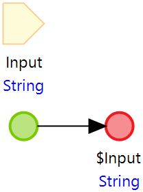

# Use a Test Suite variable

## Howto

This document describes how to create a Test Suite variable (of type String, Integer, Long, Decimal, Datetime, Boolean or Enumeration).
It is possible to define a variable once, reuse it across the entire Test Suite, and optionally add it to the Data Variation. 

### Use the MTA Utility Module

The MTA Utility Module contains several extension microflows that can be used to perform operations that are not native functions of MTA (yet).

[Download the MTA Utility Module here](https://6434334.fs1.hubspotusercontent-na1.net/hubfs/6434334/MTA%20releases/MtaUtilityModule_mx9_24_2.mpk)

Use any of the GET_String / GET_Integer etc. microflows and fill in the value that you want to reuse in the Test Suite.

### Do it yourself

Simply create a microflow in your project that takes a parameter and returns exactly the same parameter.  
Call that microflow using a Microflow Teststep, and you can then use the output everywhere in the same test suite.

Example of this microflow:

## Feedback?
Missing anything? [Let us know!](mailto:support@menditect.com)

Last updated 14 june 2023