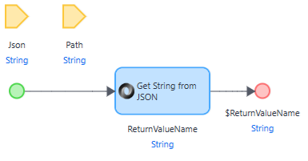

# Assert JSON value

## Definition

This document describes how to [Assert](../../../mta/Assert/) a value (or values) existing inside a JSON string.

You can use the [JsonPath](https://jsonpath.com/) query expressions in MTA to search for any value when providing the key for a certain key-value pair. 

Although the option to use Json Path as part of the [MTA Commons module](../../../Tools/mta-commons) will be added in a future release, below is the current workaround.

## JSON Path module

- Import the Json Path module created by MxLabs: https://marketplace.mendix.com/link/component/107685.
- Create "wrapper" microflows for the Java actions in order to expose them to MTA (that take the same Json and Path parameters, and return the same String as the Java action).



- Use the microflows in MTA to query through the JSON string.

## Examples

### Example 1: MTA Test Case result

Consider the following JSON string:

```json
[
    {
        "Key": 119,
        "Sequence": 1,
        "Name": "Test Case #1",
        "Result": "Pass",
        "ResultMessage": "",
        "Url": "http://localhost:8081/link/testcaserun/119"
    },
    {
        "Key": 120,
        "Sequence": 2,
        "Name": "Test Case #2",
        "Result": "ERROR",
        "ResultMessage": "- TestCase: System error: missing parameters\n- TestStep [3]: Read access denied for member 'BerekendeKosten' of object 'PakketDienst.Pakket'",
        "Url": "http://localhost:8081/link/testcaserun/120"
    },
    {
        "Key": 121,
        "Sequence": 3,
        "Name": "Test Case #3",
        "ResultMessage": "",
        "Url": "http://localhost:8081/link/testcaserun/121"
    }
]
```

We want to add an Assert in MTA to detect if the second Test Case has Passed. 
- Add a Microflow Teststep to the `GetStringFromJSONByPath` microflow. 
- Use the above JSON string for the `Json` parameter;
- Use this query for the `Path` parameter: `$[1].Result`
- Add an Assert that the output will be `Passed` (note, this Assert will fail because the result is `ERROR`!)

### Example 2: From JSONPath online

Consider the following JSON string:

```json
{
  "firstName": "John",
  "lastName" : "doe",
  "age"      : 26,
  "address"  : {
    "streetAddress": "naist street",
    "city"         : "Nara",
    "postalCode"   : "630-0192"
  },
  "phoneNumbers": [
    {
      "type"  : "iPhone",
      "number": "0123-4567-8888"
    },
    {
      "type"  : "home",
      "number": "0123-4567-8910"
    }
  ]
}
```

We want to Assert (or find) the City within the Address.
- Add a Microflow Teststep to the `GetStringFromJSONByPath` microflow. 
- Use the above JSON string for the `Json` parameter;
- Use this query for the `Path` parameter: `$.address.city`

We now want to find the number for the home telephone.
- Add a Microflow Teststep to the `GetStringFromJSONByPath` microflow. 
- Use the above JSON string for the `Json` parameter;
- Use this query for the `Path` parameter: `$.phoneNumbers[1].type`