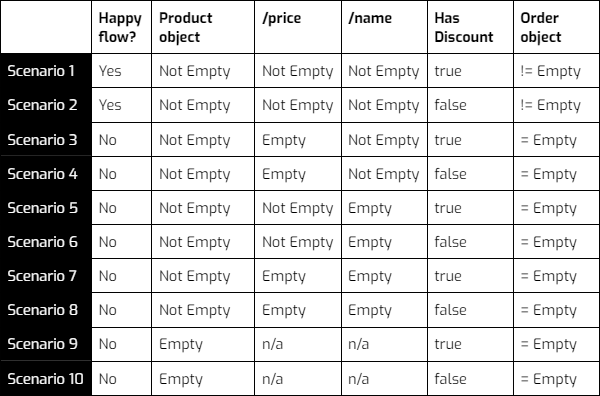

# Design Microflow testing

How to prepare for testing microflows is a strategy that needs to be considered seperately. A single microflow can be regarded as a unit, a process or can be used for regression testing. More important to consider when designing tests is the amount of different possible execution paths or outcomes that exist in the microflow. This amount can grow rather quickly.  

An example to illustrate: 

- Microflow ACT_CreateOrder takes 2 input parameters; 
  - a Product object (with mandatory price and name attributes)
  - a boolean HasDiscount
- The output of the microflow is an Order object. 

Given these parameters there are already 10 test variations to consider:

To achieve a 100% test coverage on this microflow at least 10 tests are needed, and even this is only considering data; without defining any expected error messages that should or should not occur. 

As part of the test strategy, **define the maximum number of variations** that are acceptable to achieve a 100% test coverage. Furthermore, define a strategy for the situation when exceeding this amount. What should the tester base their decisions on which scenarios need to be covered? Consider the following elements:

- Happy path (at least these should be covered)
- Probability  (more probable scenarios first)
- Risk (high risk scenarios first)
- Impact (high impact scenarios first)

## Feedback?
Missing anything? [Let us know!](mailto:support@menditect.com)

Last updated 9 April 2024