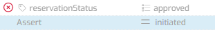
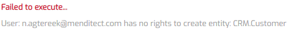
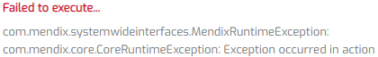

# Deal with a failed Test Run

## Functional vs technical failed Test Run

If a Test Configuration was executed, there are two reasons the Test Run can fail:
1. A functional error like a failed assert or validation feedback.
2. A technical error (Exception) in the Application. 

*An example of a functional error: Value was different from the Assert value *

*An example of a technical error: Execution user does not have access to a certain resource*

This document covers the second reason; for Asserts, please consult the reference guide.

The icons on a Teststep showing the different possible outcomes are as follows:

| A successful test                           | Functionally failed                               | Technically failed                               |
| ------------------------------------------- | ------------------------------------------------- | ------------------------------------------------ |
|  |  |  |

An important difference between a functional error and a technical error during a Test Run, is that when MTA encounters a functional error, it will continue the Test Run; when MTA encounters a technical error, it will abort the Test Run.

## Consequences

If a Test Run is aborted, it may sometimes be difficult to deal with the resulting data, that is usually incomplete. Currently, all the data that was committed in a Microflow or Persisted in a Teststep by MTA, is permanently stored in the database, *except* for the last running Test Case where the technical error occured. All the data in the last running Test Case is rolled back. 

To clarify, consider the following Test Suite example:

1. [Test Case] Create Customer masterdata
2. [Test Case] Create Order for Customer
3. [Test Case] Fill Order and create Invoice
4. [Test Case] Send Invoice to Customer
5. [Test Case] Cleanup Order and Customer data

Now let's execute this Test Suite:

1. <i class="fas fa-check"></i> Create Customer masterdata
2. <i class="fas fa-check"></i> Create Order for Customer
3. <i class="fas fa-check"></i> Fill Order and create Invoice
4. <i class="fas fa-times"></i> Send Invoice to Customer
5. Cleanup Order and Customer data

The first four Test Cases were executed, but the fourth failed, leading to a rollback for that Test Case. This means that all the data from the first three Test Cases still exists because the last Test Case was not executed. Also, without inspecting the Teststeps in the fourth Test Case, it is not clear if any external source like an API or SMTP server was contacted, or that the Test Case failed before encountering the respective Teststep.

The best way to avoid this scenario is to follow the Best Practice of cleaning up data *before* the test execution, and to use custom (Microflow) logic where data is first checked and then deleted, instead of using Retrieve and Delete Object Teststeps for this.

## Troubleshooting

Below is a list of possible errors and possible workarounds for these errors.

- When executing, on a teststep the following technical error is displayed:  This could be due to retrieving a nonpersistable object from database, or a persistable object from database, associated to a nonpersistable object, that is the output of a former teststep.  > Try changing the retrieve to "by association" instead of "from database".

## Feedback?
Missing anything? [Let us know!](mailto:support@menditect.com)

Last updated 13 may 2022