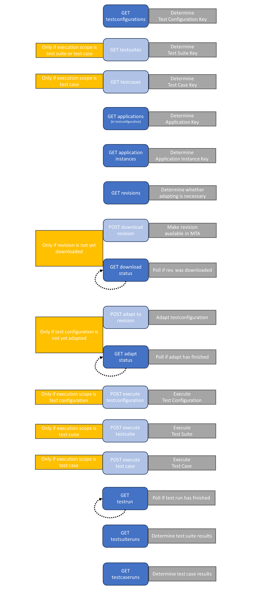

# CI/CD flow

## Definition

This document describes the order of MTA's [API endpoints](../../../api), to optimize an automated pipeline, that is used to execute a test in MTA. 

It helps you to get started and test if you can call the endpoints correctly, but also structure your pipeline into becoming a fully automated flow.

## Get started

The MTA Public API uses Keys to uniquely refer to objects in the database, as an alternative to using the Mendix internal Object ID (which is very long and not exposed in MTA), or object names (which are not always unique). As a result, the best way to get started is by using the Key of the Test Configuration, Application and Application Instance, to call the endpoints that you need.

For getting started, let's will assume that the goal is to:
- download the latest revision of an App into MTA;
- adapt a Test Configuration (with only 1 App) to this revision;
- execute the Test Configuration.

### Step 1
To download the latest revision, you need the Application Key and branch name and commit ID of the revision. You can find the Application Key by opening the Applications page and [View Key and Project ID](../../../application#view-key-and-project-id) of your App. Branch name and commit ID can be found in Mendix Sprintr or Studio Pro. You now have the information you need to call [POST download revision](../../../api#post-download-revision). Save the Application Revision Key that is returned by this endpoint.

### Step 2
You can choose to wait until the download finishes, or use the [GET revision download status](../../../api#get-revision-download-status) endpoint, to poll every so-many seconds and check if it is finished. For that you need the Application Revision Key from the previous step.

### Step 3
Now you will adapt the Test Configuration to the downloaded revision. You need the Test Configuration Key for that. You can find the Test Configuration Key by [Editing the Test Configuration](../../../test-configuration#edit-a-test-configuration). The Key is shown in the header at the end of the title. You now have the information you need to call [POST adapt testconfiguration to revision](../../../api#post-adapt-testconfiguration-to-revision). 

### Step 4
You can choose to wait until the adapt finishes, or use the [GET testconfiguration adapt status](../../../api#get-testconfiguration-adapt-status) endpoint, to poll every so-many seconds and check if it is finished. You will need the Test Configuration Key for that.

### Step 5
Now you can execute the Test Configuration. You need the Application Instance Key for that. You can find the Key by [Editing the Application Instance](../../../application-instance#edit-an-application-instance). The Key is shown in the header at the end of the title. You now have the information you need to call [POST execute testconfiguration](../../../api#post-execute-testconfiguration). 

## Automate Flow

### 1: get testconfigurations

If you know the Key of the Test Configuration that you want to execute, you can skip this step. You can find the Key by [Editing the Test Configuration](../../../test-configuration#edit-a-test-configuration). The Key is shown in the header at the end of the title.

If you only know the Name, use this step to get a list of Test Configurations. This way you can filter the list by name so you can determine the Key of the Test Configuration.

### 2: get testsuites

If you want to execute the whole Test Configuration, you can skip this step.

If you want to execute a single Test Suite, and you know the Key of the Test Suite that you want to execute, you can skip this step. You can **find the Key** by [Editing the Test Suite](../../../test-suite#edit-a-test-suite). The Key is shown in the header at the end of the title.

If you want to execute a single Test Suite, and you only know the Name, use this step to get a list of Test Suites in the Test Configuration. This way you can filter the list by name so you can determine the Key of the Test Suite.

If you want to execute a single Test Case, also use this step to determine the Key of the Test Suite that the Test Case is in. 

### 3: get testcases

If you want to execute a single Test Case, and you know the Key of the Test Case that you want to execute, you can skip this step. You can **find the Key** by [Editing the Test Case](../../../test-suite#edit-a-test-case). The Key is shown in the header at the end of the title.

If you want to execute a single Test Case, and you only know the Name, use this step to get a list of Test Cases in the Test Suite. This way you can filter the list by name so you can determine the Key of the Test Case.

### 4: get applications

If you know the Key of the Application(s) in use of the Test Configuration that you want to execute, you can skip this step. You can **find the Key** by opening the Applications page and [View Key and Project ID](../../../application#view-key-and-project-id). 

Otherwise use this step to get a list of Application Keys in use of the Test Configuration.

### 5: get application instances

If you know the Key of the Application Instance(s) that you want to execute the Test Configuration on, you can skip this step. You can **find the Key** by [Editing the Application Instance](../../../application-instance#edit-an-application-instance). The Key is shown in the header at the end of the title.

Otherwise use this step to get a list of Application Instance Keys for each Application Key from the previous step.

### 6: get revisions

Use this step to determine if the Test Configuration is adapted to the Application Revision(s) that you want to use.

### 7: download revision

If the Test Configuration is adapted to the Application Revision(s) that you want to use, you can skip this step. 

Otherwise use this step to download the Application Revision(s) in MTA so you can adapt the Test Configuration accordingly.

### 8: get revision status

If the Application Revision(s) that you want to use for the Test Configuration are downloaded in MTA, you can skip this step.

Otherwise use this step (preferably in a loop statement) to poll if the download revision action from the previous step is done, to determine if the Application Revision(s) that you want to use for the Test Configuration are downloaded in MTA.

### 9: adapt test configuration to revision

If the Test Configuration is adapted to the Application Revision(s) that you want to use, you can skip this step.

Otherwise use this step to adapt the Test Configuration to a downloaded Application Revision.

### 10: get adapt status

If the Test Configuration is adapted to the Application Revision(s) that you want to use, you can skip this step. 

Otherwise use this step (preferably in a loop statement) to poll if the adapt revision action from the previous step is done, to determine if the Test Configuration is adapted to the Application Revision(s) that you want to use.

### 11: execute test configuration

If you want to execute a single Test Suite, you can skip this step.

If you want to execute a single Test Case, you can skip this step.

Otherwise use this step to execute the Test Configuration, and determine the resulting Execution ID.

### 12: execute test suite

If you want to execute a single Test Configuration, you can skip this step.

If you want to execute a single Test Case, you can skip this step.

Otherwise use this step to execute the Test Suite, and determine the resulting Execution ID.

### 13: execute test case

If you want to execute a single Test Configuration, you can skip this step.

If you want to execute a single Test Suite, you can skip this step.

Otherwise use this step to execute the Test Case, and determine the resulting Execution ID.

### 14: get testrun

Use this step (preferably in a loop statement) to poll if the testrun triggered by the previous steps is finished.

### 15: get testsuiteruns

Use this step to get the results of the executed test suites inside the testrun from the previous step.

### 16: get testcaseruns

Use this step to get the results of the executed test cases inside the executed test suites from the previous step.

## Visualized

## Feedback?
Missing anything? [Let us know!](mailto:support@menditect.com)

Last updated 25 september 2023