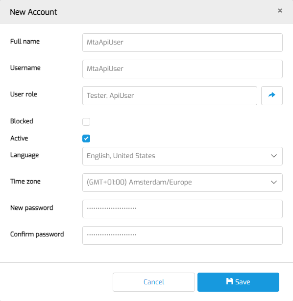

# MTA API Prerequisites

## Definition

This document describes how to configure MTA to use the [Public API](../../../api).

## Create API user

In order to prepare MTA for integration with your CI/CD pipeline you need to create a user in MTA with *only* the Tester and ApiUser roles. 

- First, login as an MTA Manager. Do not login with an account that has Administrator rights!
- Navigate to MTA management and then to MTA Users. Create a New local MTA user.
- Then, fill in the form like this:

This is the username and password you will connect with to the API. 

- Save and logout.
- Then, login with the API user, click the <i class="fal fa-user-circle"></i> user icon on the top right and [fill in the PAT](../configure-mta/access-mendix-model).
- Finally, if you also want MTA to push testrun results to your own API endpoint, enter the Endpoint and Secret key. Read more about it on the [CI/CD result handling page](cicd-result).

## Create an Authorization string

Unless you are using a Mendix Microflow action for calling API Endpoints, you need to create an Authorization string for [Basic access authentication](https://en.wikipedia.org/wiki/Basic_access_authentication) that you have to fill into the API tool that you are using.
1. In a notepad tool, type the username and password for above created user, separated by a single colon `myusername:mypassword`
2. Copy this string into the input field of a Base64 encoder, for example https://www.base64encode.org/ and copy the output.
3. In a notepad tool, type `Basic ` (mind the space at the end!) and the resulting string from step 2.
4. Store the result in a password manager.

## Check App status
The Public API can be used in a pipeline that performs deployments of a Mendix Application. But it does not check if the deployment is done.

:::info 
Before executing a testrun, check that the deployment is completed and the status of the <a href="../../../mta/application-instance">Application Instance</a> is "Running".
:::

## Cleanup testruns
No need to clean up testruns manually. Currently, a nightly scheduled event cleans up executed [Test Runs](../../../mta/test-run). MTA only keeps test runs associated with the last two executions for a single Application. 

## Feedback?
Missing anything? [Let us know!](mailto:support@menditect.com)

Last updated 20 May 2026