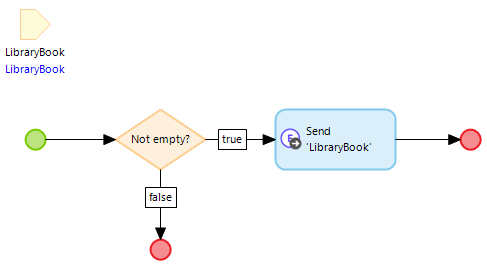
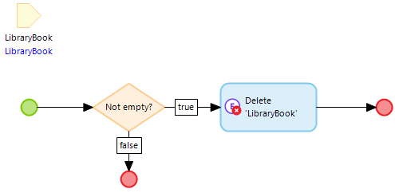

# Use Data Hub with MTA

## Howto

This document describes how to handle entities that are created from a published OData source (whether or not connected via the Data Hub in Mendix) in MTA.

The assumption is made that both the publishing App and the consuming App are built in Mendix.

### Retrieving OData objects

Retrieving data from a Dataset that is exposed as an Entity in a Mendix App works exactly the same as retrieving data from a regular Entity.

It is possible to use a regular [Retrieve teststep](../../../Teststep/retrieve). Domain model access must be configured for the Entity, allowing the Execution user Read Access.

### Creating OData objects

Creating data from a Dataset that is exposed as an Entity in a Mendix App can be done by a [Create teststep](../../../Teststep/create), but saving the data to the database of the publishing App cannot be done by using [Persist](../../../Teststep/persist). This must be handled by a Microflow call, where the microflow contains a "Send external object" action. Only a single object can be committed by this action. It is best to check if the object is not empty first, to allow for similar behaviour as in MTA.

Domain model access must be configured for the Entity, allowing the Execution user Create and Write Access. 

Additionally, the Published OData service must allow the Insertable and Updatable capability for the published resource:
https://docs.mendix.com/refguide/published-odata-resource/#capabilities 

### Changing OData objects

Changing data from a Dataset that is exposed as an Entity in a Mendix App can be done by a [Change teststep](../../../Teststep/change), but saving the data to the database of the publishing App cannot be done by using [Persist](../../../Teststep/persist). This must be handled by a Microflow call, where the microflow contains a "Send external object" action. Only a single object can be committed by this action. It is best to check if the object is not empty first, to allow for similar behaviour as in MTA.

Domain model access must be configured for the Entity, allowing the Execution user Write Access. 

Additionally, the Published OData service must allow the Updatable capability for the published resource:
https://docs.mendix.com/refguide/published-odata-resource/#capabilities 

### Deleting OData objects

Deleting data from a Dataset that is exposed as an Entity in a Mendix App can **not** be done by a [Delete teststep](../../../Teststep/delete) combined with [Persist](../../../Teststep/persist). Deletion must be handled by a Microflow call, where the microflow contains a "Delete external object" action. Only a single object can be deleted by this action. It is best to check if the object is not empty first, to allow for similar behaviour as in MTA.

Domain model access must be configured for the Entity, allowing the Execution user Delete Access. 

Additionally, the Published OData service must allow the Deletable capability for the published resource:
https://docs.mendix.com/refguide/published-odata-resource/#capabilities 

### Handling errors

Errors as a result of restrictions (such as Access restrictions or Domain model Validation Rules) in the publishing App are shown on the details of the Teststep run when executing the Test Case in MTA. 

If the publishing App is not running, the error will be `The OData endpoint returned 503 Service Unavailable.` This error will be shown either upon a Retrieve teststep, or upon committing or deleting in the external database (using abovementioned microflow actions).

## Feedback?
Missing anything? [Let us know!](mailto:support@menditect.com)

Last updated 23 june 2023