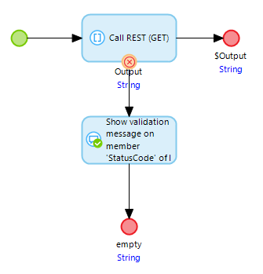

# Assert on an Exception

## Definition

Sometimes the expected outcome of a test run, is that the test run will fail. 
A test run fails because of a technical error, or because an assert failed. 
See also: [How to deal with a failed test run](../run-tests/deal-with-failed-testrun).

Because of this, it is not possible to assert that the test run *will* fail due a technical error.

However it is possible to use a custom error flow in the microflow where the error is likely to occur, and have Mendix generate validation feedback in that custom error flow.

Take a look at this simple microflow that calls a REST service:

If the REST call fails, the microflow will throw an Exception. 
If the microflow is called from MTA, the test run will fail with a technical error, stop executing, and any data generated in the test case will be rolled back.

To assert that the REST call *will* fail, first change the microflow with a custom error flow that includes a validation message action:

Now it is possible to [assert on the validation message](../../../mta/Assert/assert-validation-feedback) containing, for example, an HTTP Status Code 500.

## Feedback?
Missing anything? [Let us know!](mailto:support@menditect.com)

Last updated 5 March 2024