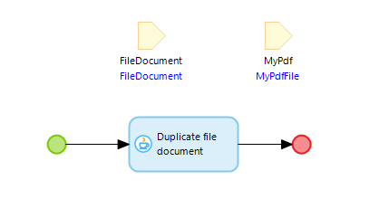

# Handle files
@@todo
MTA does not (yet) allow uploading a `FileDocument` into your Test App.

This also means, that using Binary attributes is not (yet) supported.

However, there are some ways to include the Uploading and Downloading of files into your test process. 
Using a [Frontend test](../../../mta/frontend-test) is the recommended approach.

It is also possible to use an extension microflow inside the Test App to create the files. 

## Duplicate existing FileDocument

- Create (if not yet exists) an MTA extension module in the tested App.
- Add a User to the module.
- Add an entity that inherits from FileDocument or Image, for instance `MyPdfFile`.
- Give the User full access to that entity.
- Build a NewEdit Page to upload files of this type.
- Create a microflow with only a single (Java) Duplicate File Document action from the Community Commons module. It should look like this:

Now, it is possible to use this pattern in a Test Case, to test processes that require a file:
1. Teststep that Creates an empty filedocument as used in the tested process (for example, a 'TemplateDocument' as is used in the Excel Importer).
2. Persist (to ensure the object is saved to the database, otherwise the Java action won't work).
3. Teststep that Retrieves the filedocument from the MTA extension module's entity.
4. Microflow call to the abovementioned microflow with parameters: teststep 1 as Target, and teststep 3 as Source.
5. Other logic to perform the actual test.
6. Optional delete logic to clean up.

## Create FileDocument from a Base64 string

- Create (if not yet exists) an MTA extension module in the tested App.
- Add a User to the module.
- Add an entity that inherits from FileDocument or Image, for instance `MyImage`.
- Give the User full access to that entity.
- Create a microflow that decodes a String to a FileDocument using the (Java) Base64 decode to file action from the Community Commons module. It should look like this:

An example String that decodes into the Menditect Logo can be found [here](../images/menditectlogo.txt).

Now, just add a [Teststep](../../../mta/Teststep/microflow) in MTA calling this microflow, and you can use the created file anywhere in the Test Case.

## Feedback?
Missing anything? [Let us know!](mailto:support@menditect.com)

Last updated 27 January 2025