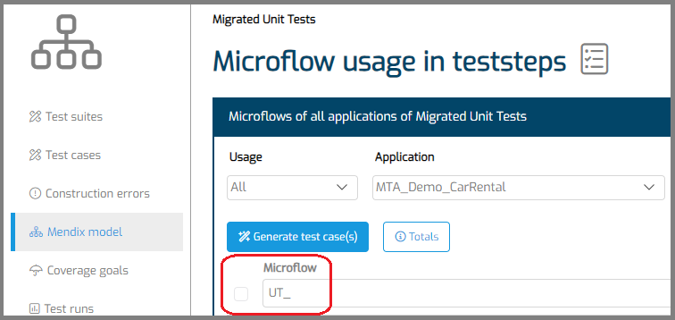

# Migrate Mendix Unit Tests

## Definition

This document helps you to migrate tests for the [Mendix Unit Test module](https://docs.mendix.com/appstore/modules/unit-testing/) to MTA.

## Steps 

1. [Create a new Test Configuration](../../../mta/test-configuration#create-a-new-test-configuration).
2. Navigate to "Mendix Model" to use the [Test Case generation feature](../design-tests/generate-test#test-a-microflow). 
3. Use the "Microflow" filter textbox, to filter on microflows tested in the Mendix Unit Test Module. 
4. Filter on "UT\_" or "TEST\_".
5. Select all microflows that are visible, using the checkbox left of the filter.
6. Use the "Generate test case(s)" button to generate test cases for up to 11 microflows at a time.

7. When finished, open a Test Case, and add an [Assert](../../../mta/Assert/assert-microflow-output):
   - If the microflow returns a Boolean, assert "True";
   - If the microflow returns a String, select assert type "Not equals" and leave the value blank;
   - If the microflow does not return anything, check the [Assert on an Exception](assert-exception) how-to.

## Feedback?
Missing anything? [Let us know!](mailto:support@menditect.com)

Last updated 27 March 2024