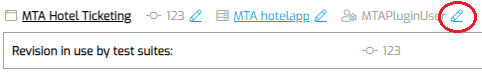
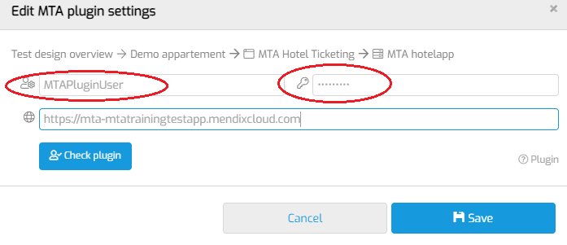

# Access environment

After MTA can access the projects linked to the Mendix user, the Mendix model can be downloaded for a selected revision. However, to communicate with the environment the App is running on, the MTA Plugin User must be linked as well.

- Add a new Test Application, or open an existing one and click on the pencil icon next to the existing plugin user settings, to edit:  
- In the Mendix application under test, a local user has been created with the “MTA Plugin” role. Enter the username and password in this page:   
- Click “Check plugin” to make sure a connection can be made.
Note: If this check is performed three times unsuccessfully because the password is incorrect, Mendix can temporarily block the user.

## Feedback?
Missing anything? [Let us know!](mailto:support@menditect.com)

Last updated 21 april 2022