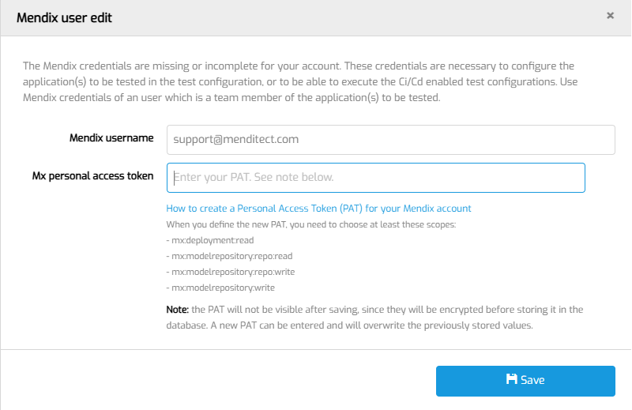

# Access Mendix model

To access Mendix projects, the user who logs in to MTA must be linked to a Mendix user.
First time you login as a Tester, you will be provided a page where you can enter the necessary information to create this link.

## Personal access token

A Personal Access Token (PAT) needs to be created to make communication possible with MTA and the Mendix platform. Make sure to store it in a password manager after creation. 

### Create your PAT in your Mendix account

- Go to https://user-settings.mendix.com/link/developersettings
- Click "New token". Name it 'MTA Test'.
- Under **`Deployment Mendix Cloud`**,  select `mx:deployment:read` 
- Under **`Model Repository`**,  select `mx:modelrepository:repo:read` 
- Click "Create".
- Store it in the password manager so you don't lose it.

### Enter PAT in MTA

Login to MTA using the credentials provided by your MTA Manager.

The following popup will appear:

Now fill in the fields under 'Mendix credentials'
- The Mendix account username (the email address you registered with at Mendix);
- Your PAT;

Then choose "Save".

If you need to change this information later, click the <i class="fal fa-user-circle"></i>  user icon on the top right.

To test if this step was successful, try to [Add an Application](run-first-test). The Mendix projects associated with the given Mendix user should be visible.

## Feedback?
Missing anything? [Let us know!](mailto:support@menditect.com)

Last updated 19 February 2024