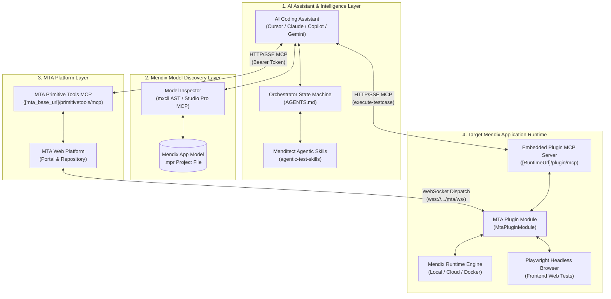
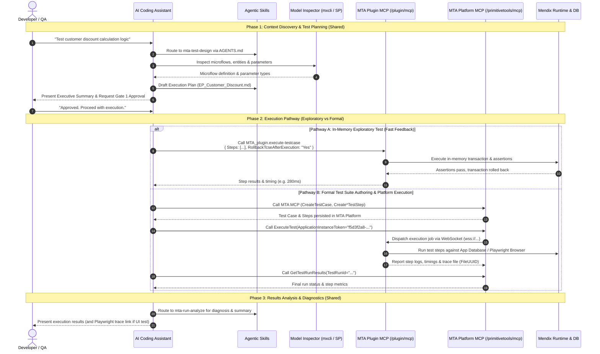

# Agentic Testing Overview

This guide describes the **system architecture and unified interaction workflows** for running Agentic Test Automation with Menditect Test Automation (MTA) and AI assistants (such as Cursor, Claude Code, GitHub Copilot, Gemini / Antigravity, and Cline).

---

## 1. System Overview

Agentic Test Automation connects four decoupled systems that communicate through standard protocols (MCP, HTTPS, and WebSockets):



### The 4 Core Systems

| System                                                       | Role                                                                                                                                                                                                                                       | Primary Interface / Protocol                                     |
| :----------------------------------------------------------- | :----------------------------------------------------------------------------------------------------------------------------------------------------------------------------------------------------------------------------------------- | :--------------------------------------------------------------- |
| **1. MTA Platform (MTA Server)**                             | Central test management repository, orchestration engine, and authoring backend. Hosts test suites, test cases, and historical runs. Exposes **MTA Primitive Tools MCP** for authoring and platform dispatch.                              | HTTPS / SSE MCP (`/primitivetools/mcp`)                          |
| **2. MTA Mendix Plugin (`MtaPluginModule`)**                 | Embedded module running inside your Mendix application. Connects via WebSocket to MTA for formal test dispatch, and exposes an embedded **HTTP MCP server** (`/plugin/mcp`) for in-memory exploratory test execution (`execute-testcase`). | WebSocket (MTA Connection) & HTTP/SSE MCP (`/plugin/mcp`)        |
| **3. Mendix Model Discovery (`mxcli` / Studio Pro MCP)**     | AST inspection engines parsing domain entities, microflows, nanoflows, pages, and widgets. Provides semantic app context to the AI assistant.                                                                                              | CLI Stdio (`./mxcli`) or HTTP MCP (`localhost:7782/mcp`)         |
| **4. Menditect Agentic Test Skills (`agentic-test-skills`)** | Structured testing intelligence guiding AI assistants. Enforces conversational state routing (`AGENTS.md`), 9-section **Execution Plans** (`EP_*.md`), layered step construction, and failure diagnostics.                                 | Markdown / Skill Standard (`skills/` or `skillssource/_modules`) |

---

## 2. Unified System Interaction Workflow

Whether executing a rapid, in-memory exploratory test or authoring a permanent test suite in the MTA repository, the lifecycle follows a **single unified workflow**.

Both pathways share the same discovery, model analysis, and execution plan design phases. The only difference is the execution target: the **local runtime MCP plugin** (for sub-second in-memory tests with automatic rollback) or the **MTA Platform MCP** (for permanent suite authoring and platform test dispatch).




---

## 3. Configuration Contract: `mta_config.json`

The `mta_config.json` document serves as the **Single Source of Truth (SSOT)** for AI assistants, providing all endpoints, directory paths, application instances, and model discovery sources.

### Canonical Structure

```json
{
  "$schema": "./mta_config.schema.json",
  "workspace_type": "clone_root",
  "workspace_dir": "C:\\Projecten\\my-workspace",
  "skills_dir": "C:\\Projecten\\my-workspace\\skills",
  "skills_style": "standard",
  "mta_output_path": "C:\\Projecten\\my-workspace\\menditect-output",
  "execution_plans_dir": "C:\\Projecten\\my-workspace\\menditect-output\\execution-plans",
  "mendix_version": "11.12.011",
  "application_name": "CarRental_App",
  "mta_base_url": "https://mta-trial.mendixcloud.com",
  "mcp_endpoint": "https://mta-trial.mendixcloud.com/primitivetools/mcp",
  "plugin_mcp_url": "http://localhost:8081/plugin/mcp",
  "playwright_viewer_url": "https://trace.playwright.dev/?trace=",
  "tracefile_base_url": "http://localhost:8081/rest/private/tracefile?fileUUID=",
  "app_instances": [
    {
      "name": "Local Development",
      "token": "f5d3f2a8-eb39-4cf5-9dfc-7fdeaf79c80d",
      "mtaUrl": "https://mta-trial.mendixcloud.com",
      "runtimeUrl": "http://localhost:8081/",
      "pluginUrl": "http://localhost:8081/plugin/mcp",
      "pluginToken": "Bearer 1",
      "pluginPort": "8081"
    }
  ],
  "default_app_instance": "Local Development",
  "default_app_instance_token": "f5d3f2a8-eb39-4cf5-9dfc-7fdeaf79c80d",
  "model_source": "mxcli",
  "mendix_project_dir": "C:\\MendixProjects\\CarRental",
  "mendix_mpr_path": "C:\\MendixProjects\\CarRental\\CarRental.mpr"
}
```

### Property Reference

| Property                     | Type          | Required | Description                                                                                           |
| :--------------------------- | :------------ | :------: | :---------------------------------------------------------------------------------------------------- |
| `application_name`           | string        | **Yes**  | Target application name in MTA. Eliminates manual application selection prompts.                      |
| `mta_base_url`               | string (URI)  | **Yes**  | Web portal URL of the MTA platform (e.g. `https://mta-trial.mendixcloud.com`).                        |
| `mcp_endpoint`               | string (URI)  | **Yes**  | MTA Primitive Tools MCP endpoint (`[mta_base_url]/primitivetools/mcp`).                               |
| `execution_plans_dir`        | string        | **Yes**  | Filesystem path where active Execution Plans (`EP_*.md`) are persisted.                               |
| `mendix_project_dir`         | string        | **Yes**  | Absolute directory path to the target Mendix project folder.                                          |
| `mendix_mpr_path`            | string        |    No    | Absolute path to the `.mpr` project file used by `mxcli`.                                             |
| `plugin_mcp_url`             | string (URI)  |    No    | Embedded MTA Plugin MCP URL (`http://localhost:8081/plugin/mcp`).                                     |
| `app_instances`              | array         |    No    | Array of environment profiles containing instance names, tokens, URLs, and ports.                     |
| `default_app_instance`       | string        |    No    | Name of the primary default environment (e.g. `"Local Development"`).                                 |
| `default_app_instance_token` | string (UUID) |    No    | MTA Application Instance Token used automatically by `ExecuteTest`.                                   |
| `model_source`               | string        |    No    | Model discovery engine: `"mxcli"` (offline `.mpr` inspection) or `"studiopro"` (Studio Pro live MCP). |
| `playwright_viewer_url`      | string (URI)  |    No    | Base URL for the trace viewer interface (`https://trace.playwright.dev/?trace=`).                     |
| `tracefile_base_url`         | string        |    No    | Endpoint to download trace files (`[RuntimeUrl]/rest/private/tracefile?fileUUID=`).                   |

### Sensitive Tokens in `.env`
Sensitive authentication tokens are maintained in `.env` rather than committed into `mta_config.json`:

```ini
# MTA Primitive Tools MCP Header
MTA_MCP_AUTH_HEADER="Bearer eyJhbGciOi..."

# MTA Plugin MCP Header
PLUGIN_MCP_TOKEN="Bearer 1"

# Application Instance Token (Fallback)
MTA_APPLICATION_INSTANCE_TOKEN="f5d3f2a8-eb39-4cf5-9dfc-7fdeaf79c80d"
```

### Configuration Resolution Order
AI assistants evaluate configuration sources in this strict order:
1. **`mta_config.json` (Priority #1 - SSOT)**
2. **Project `AGENTS.md` Directives**
3. **Environment Variables (`.env`)**
4. **IDE Settings (`settings.json`)**
5. **Interactive User Prompt** *(only if a required setting is absent across all sources)*

---

