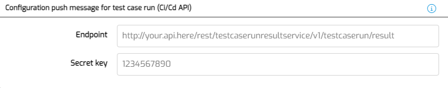

# CI/CD handle results

## Definition

This document describes the how to obtain results from an executed CI/CD testrun.
There are 3 ways to view results of a CI/CD testrun.

## 1. View results in MTA 
To view the detailed results of a testrun that is executed from CI/CD, login on MTA, and navigate to "Ci/Cd runs". All the executed CI/CD testruns are listed here with their respective Execution ID, also the ones that were not successful. 
Using the Details button it is possible to view the results of the testrun.

## 2. Download results in CI/CD API
With the [Get testruns result](cicd-config#get-testrunsresult) request in the CI/CD API it is possible to use your CI/CD pipeline or Test Management system to get the results, after the execution has finished.

## 3. Get realtime results in your own API endpoint
As of MTA version 2.0, it is possible to have MTA push the results after each Test Case run to your own hosted REST service. You need to tell MTA where to push the results, and provide a secret key that you should use to verify the source (MTA) upon receiving this push message.  

### Configure Endpoint and Secret key
- Login to MTA as CI/CD user
- Open the Account Settings using the <i class="fal fa-user-circle"></i> button on the top right
- Enter the Endpoint and Secret key like this:



Note that both fields are optional, but to make use of this functionality, both fields must have a value.

### Receiving results

To handle results, you should host a published REST service that allows anonymous access and contains a POST request on the location provided above, and is able to deal with this payload (JSON):

```json
{
    "ExecutionId": "2d0e47f7-f664-4d12-a27a-19ff4da319a5",
    "TestConfigurationName": "Test",
    "TestSuiteSequence": 1,
    "TestSuiteName": "Test",
    "TestCaseSequence": 1,
    "TestCaseName": "Test",
    "TestCaseRunResult": "Pass",
    "TestCaseRunResultMessage": "",
    "TestCaseRunUrl": "http://mta-menditect-9fo2p.mendixcloud.com/link/testcaserun/7",
    "MtaUrl": "http://mta-menditect-9fo2p.mendixcloud.com/",
    "ApplicationName": "MTA_Training_CarRental",
    "ProjectId": "48224593-2187-448d-abe9-9202e1b3a870"
}
```

:::info
The Timeout of the call to this Endpoint is set at 300 seconds. MTA will however not wait to continue the rest of the testrun. This means that results of the Test Cases may not be pushed in the right order. You can use the Sequences of the Test Suite and Test Case in the payload to adjust for this.
:::

Additionally, to make sure that you have all the results of a single CI/CD testrun <i>and</i> also that the testrun is finished, always use the MTA Get testruns result API as well.

### Securing the connection

When Using the Endpoint and Secret key, for each payload that gets pushed to the Endpoint, an HMAC will be generated, which then gets passed along as a header “Signature” with the request. The value of header “Signature” is Base64 encoded. The algorithm for generating a MAC is HMAC with SHA256. When comparing both signatures if they are equal, it is advisable to use a comparison function which is constant time to prevent time attacks (in Java, the function MessageDigest.isEqual is in constant time).

You should write your own logic to compare the Signature against the Secret key, but if you are using Mendix, below is a Java code snippet that you can use.

 ```java
import java.lang.*;
import com.mendix.systemwideinterfaces.core.IContext;
import com.mendix.webui.CustomJavaAction;
import java.util.Base64;
import java.security.MessageDigest;
import java.nio.charset.StandardCharsets;
import javax.crypto.Mac;
import javax.crypto.spec.SecretKeySpec;

public class signatureDecoder extends CustomJavaAction<java.lang.Boolean>
{
	private String signature;
	private String payload;
	private String secretKey;

	public signatureDecoder(IContext context, String signature, String payload, String secretKey)
	{
		super(context);
		this.signature = signature;
		this.payload = payload;
		this.secretKey = secretKey;
	}

	@java.lang.Override
	public Boolean executeAction() throws Exception
	{
		// BEGIN USER CODE
        String algorithm = "HmacSHA256";
        SecretKeySpec secretKeySpec = new SecretKeySpec(secretKey.getBytes(StandardCharsets.UTF_8), algorithm);
        Mac mac = Mac.getInstance(algorithm);
        mac.init(secretKeySpec);
        byte[] result = mac.doFinal(payload.getBytes(StandardCharsets.UTF_8));
        byte[] givenSignature = Base64.getDecoder().decode(signature.getBytes(StandardCharsets.UTF_8));   
        boolean correct = MessageDigest.isEqual(result, givenSignature);
        return correct;
		// END USER CODE
	}
}
 ```