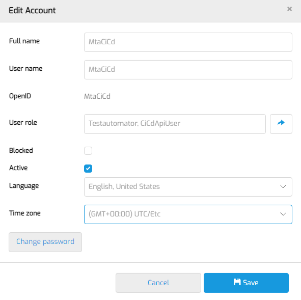

# Configure Ci/Cd pipeline

## Definition

This document describes the guidelines to use the CiCd API of MTA in a pipeline.

## Configure MTA
In order to prepare MTA for integration with your Ci/Cd pipeline you need to create a user in MTA with *only* the Testautomator and CiCdApiUser roles. First, login as an MTA Manager. Do not login with an account that has Administrator rights!
Navigate to MTA management and then to MTA Users. Create a New local MTA user.
Then, fill in the form like this:



This is the username and password you will connect with to the API. 

## Configure the Test Application

Calling the Ci/Cd API in MTA can result in zero, one or many Test Configurations to be executed. The reason is that the Ci/Cd API does not take a Test Configuration, but a Test Application as the parameter. 

### Enable Ci/Cd
Where regular test runs are executed on the Test Configuration level, Ci/Cd enabled test runs are executed on the Test Application level. When testing a Test Application, all Test Configurations that use that Test Application, that are Ci/Cd enabled, and where the environment matches the provided parameters, are executed. This means that also other Test Applications could be affected, if one of those Test Configurations use more than one.

If you want to include a Test configuration in testing, you need to enable it by editing it from the Test design page. 
Edit the respective test configuration and set "Ci/Cd enabled" to TRUE.

### Check App status
The Ci/Cd API can be used in a pipeline that always performs a deployment of the latest revision to the Test Application. 

<i class="fa fa-exclamation-triangle"></i> Before executing a Ci/Cd testrun however, it is important to check that the deployment must be complete and the status of the application should be "Running". 
<br/><br/>

## Execute a testrun from Ci/Cd

The base URL for the Ci/Cd API is:
```
{your mta node}/rest/cicdservice/v1/CiCd/
```

The Ci/Cd API knows two REST requests. 
1. POST testruns <br/> This request executes a new Ci/Cd testrun
2. GET testrunsresult <br/> This request returns the result for a previously executed Ci/Cd testrun

The contents of these requests are described next.

### POST testruns
Executes a new Ci/Cd testrun. 

If another revision is deployed to the environment than the one defined on the Test Configuration, and the environment is running on the Mendix Cloud, MTA will detect the new revision, start downloading the model changes, and apply the changes to the Test Configuration, before executing.

<i class="fa fa-exclamation-triangle"></i> If your Ci/Cd pipeline results in an error, check the timeout setting. Most tools default to 300 seconds, but if another revision needs to be downloaded this may not be long enough.
<br/><br/><br/>


**URL**

`/rest/cicdservice/v1/CiCd/testruns`

*Example: https://mta-menditect-9fo2p/rest/cicdservice/v1/CiCd/testruns*

**Authorization**

| Authorization | Basic |
| ----------- | ----------- |
| Username: | `[the CiCd username in MTA]` |
| Password: | `[the CiCd password in MTA]`|

**Input body**

| Parameter |   |
| ----------- | ----------- |
| ProjectId | `[the Mendix project ID for the Mendix App you want to execute, which can be found under the Applications page in MTA]` |
| EnvironmentName | `[the exact name of the application environment you want to test on]` |
| EnvironmentType | `[either “Custom” or “MendixCloud”]` |

*Example:* 

```
{
   "ProjectId":"fb9e16d9-05ea-42fc-91a6-41c5b2341384",
   "EnvironmentName": "Lokaal Niels",
   "EnvironmentType": "Custom"
}
```

**Output (if http response = 200/OK)**

| Parameter |   |
| ----------- | ----------- |
| ExecutionId | `[an incremented integer representing an ID for the created CiCd testrun]` |

*Example: {"ExecutionId":123}*


### GET testrunsresult

Returns the result for a previously executed Ci/Cd testrun. After a CiCd execute, use this request to poll MTA to check if the testrun is finished, for instance every 10 seconds until the result is not empty. 

**URL**

`/rest/cicdservice/v1/CiCd/testrunsresult`

*Example: https://mta-menditect-9fo2p/rest/cicdservice/v1/CiCd/testrunsresult*

**Authorization**

| Authorization | Basic |
| ----------- | ----------- |
| Username: | `[the CiCd username in MTA]` |
| Password: | `[the CiCd password in MTA]`|

**Input parameters**

| Parameter |   |
| ----------- | ----------- |
| ExecutionId | `[the ID for a previously created CiCd testrun]` |

*Example: https://mta-menditect-9fo2p/rest/cicdservice/v1/CiCd/testrunsresult?ExecutionId=123*

**Output (if http response = 200/OK)**

| Parameter |   |
| ----------- | ----------- |
| Result | `[either {"Pass"}, {"Fail"} or {} if the test is still running]` |

*Example: {"Result":"Pass"}*

## View results of a Ci/Cd testrun 
To view the detailed results of a testrun that is executed from CiCd, login on MTA, and go to the “Test run”/”Ci/Cd test runs (beta)” page. All the executed CiCd testruns are listed here with their respective Execution Id, also the ones that were not successful. 
Using the Details button it is possible to view the results of the testrun.

Note that CiCd testruns are also listed on the Test Run overview page, recognizable by the infinity ∞ icon. 
Go to [Test run](../../test-run) for more information about test runs.

## Cleanup testruns
Currently, every night a scheduled event cleans up Ci/Cd test runs. MTA only persists Ci/Cd test runs associated with the last two executions for a single test application. 

## Feedback?
Missing anything? [Let us know!](mailto:support@menditect.com)

Last updated 9 june 2022