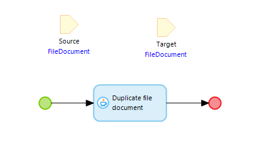

# Handle files

MTA does not (yet) allow uploading a **FileDocument** into your App.

This also means, that using Binary attributes is not (yet) supported.

If it is necessary to test a process that includes or requires uploading a file, it is recommended to perform these steps:
- Create (if not yet exists) an MTA extension module in the tested App.
- Add an entity that inherits from FileDocument.
- Add an attribute that can be used to uniquely identify an uploaded file.
- Buld a page to upload files into this entity.
- Create a microflow with only a single (Java) Duplicate File Document action from the Community Commons module. It should look like this:

Now, it is possible to use this pattern in a Test Case, to test processes that require a file:
1. Teststep that Creates an empty filedocument as used in the tested process (for example, a 'TemplateDocument' as is used in the Excel Importer).
2. Persist (to ensure the object is saved to the database, otherwise the Java action won't work).
3. Teststep that Retrieves the filedocument from the MTA extension module's entity.
4. Microflow call to the abovementioned microflow with the teststep from step 1 as target, and the teststep from step 3 as source.
5. Other logic to perform the actual test.
6. Optional delete logic to clean up.

## Feedback?
Missing anything? [Let us know!](mailto:support@menditect.com)

Last updated 21 august 2023