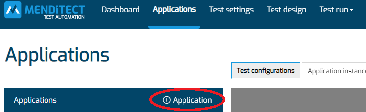
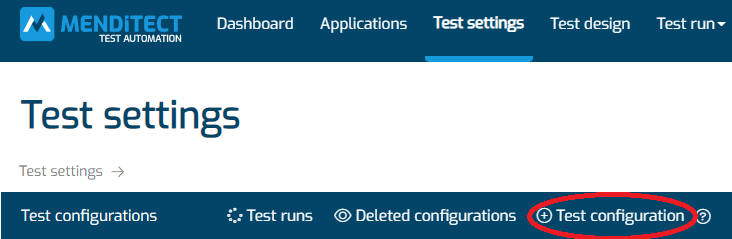
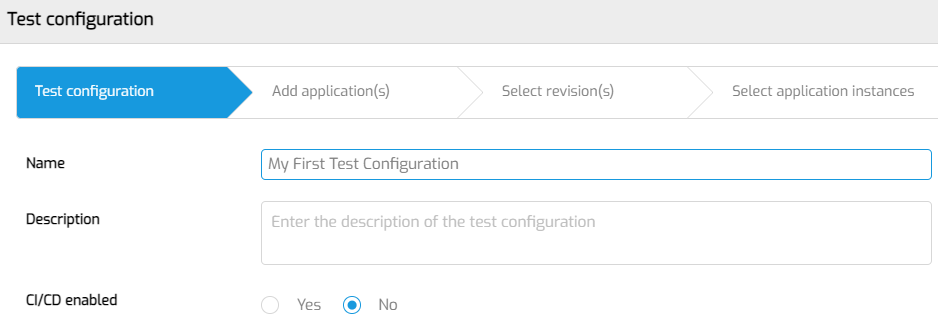
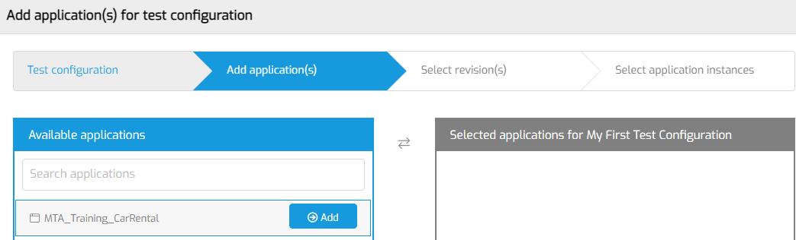
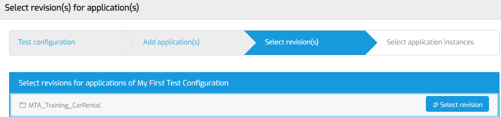
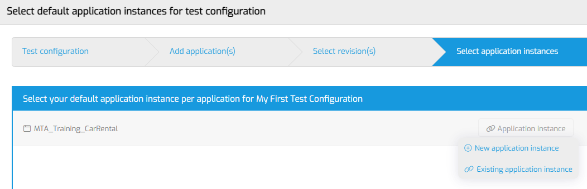

# Run your first test in MTA

These step-by-step instructions will help new MTA users add and execute their first test on a single Mendix App.

## 1. Add an Application

Your very first stop is the 'Applications' tab. 
Click on the '+ Application' button to add an Application.

Select the application that you want to test from the list.

## 2. Add a Test Configuration

Now navigate to the 'Test settings' tab.
Click on the '+ Test configuration' button to start the wizard for adding a Test Configuration.

The Wizard consists of 4 steps. 

### Step 1

Enter the name and optional description of the Test Configuration. Click 'Save and Next'. 

### Step 2

Selecting the Application under test. Select the Application that you just added to MTA and click 'Next'.

### Step 3

Click the 'Select revision' button. MTA will show a popup. Select the branch and revision that you want to test. Click 'Save and Next'. 

MTA will show a message that it will start downloading this revision.

### Step 4

The last step is selecting an application instance. Click 'Application instance'.
- If you're running your Application under test on the Mendix Cloud, click 'Existing application instance'. You can select any of the application instances MTA has detected when you added the Application.
- If you're running on another cloud provider, on premise, or on a local computer, click 'New application instance'. 

### `eof (todo)`