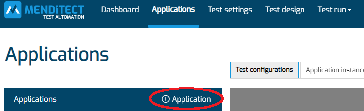
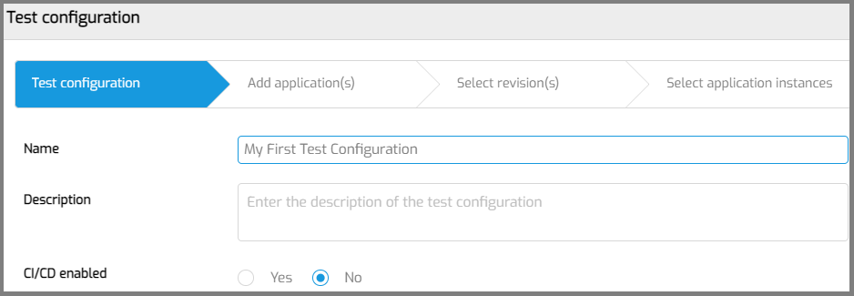
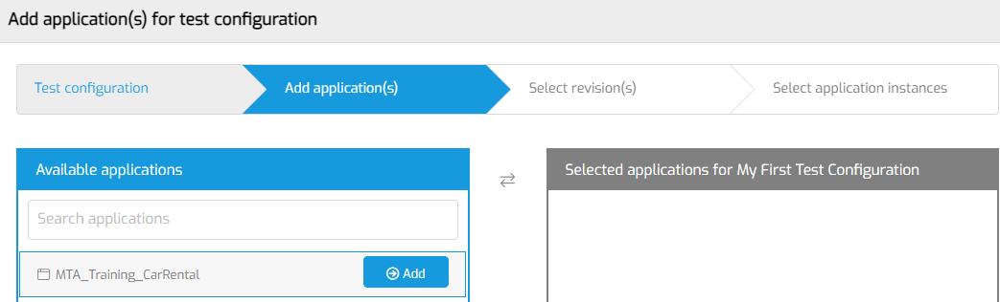
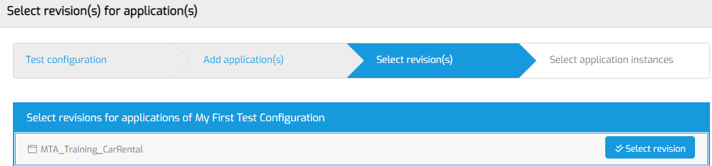
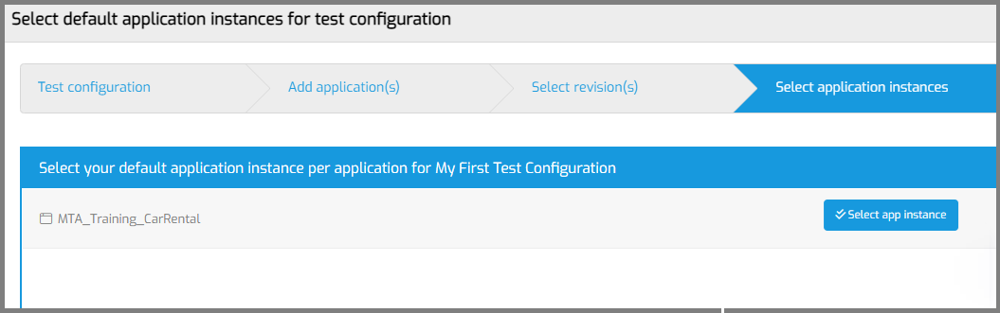
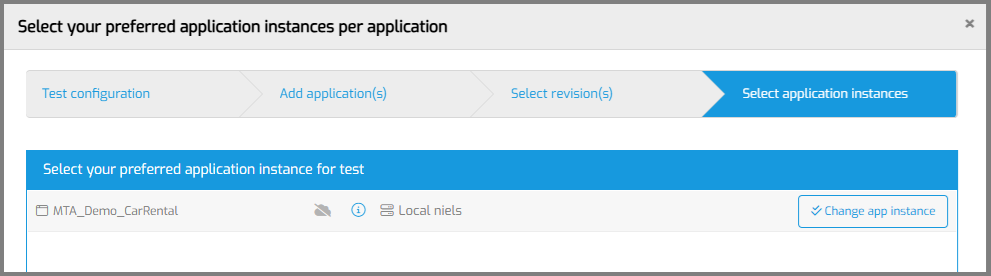
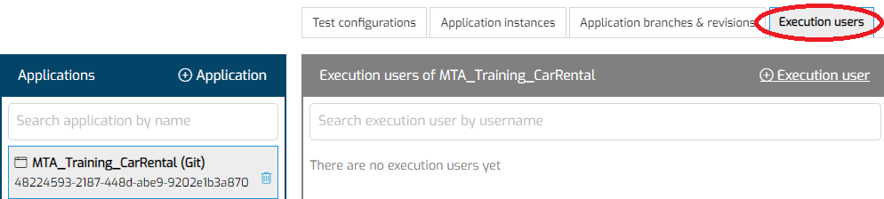
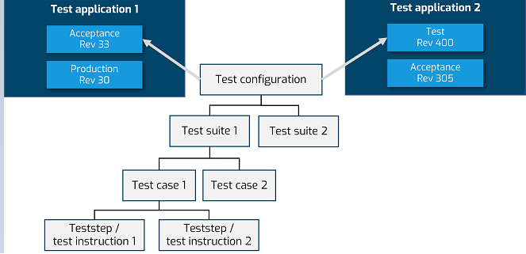

# Run your first test in MTA

**NEW: Watch the video instead!**
<iframe src="https://player.vimeo.com/video/852636928?h=601d67c079" frameborder="0" allow="autoplay; fullscreen" allowfullscreen></iframe>
 

These step-by-step instructions will help new MTA users add and execute their first test on a single Mendix App.

## Prerequisites

To go through these steps, you need
- to have access to a Licensed Mendix App which is running in a cloud environment or on your local machine,
- to know the username of an Account on this environment,
- to have finished the previous 2 walkthroughs: [prepare for using MTA](prepare-for-using-mta) and [access a Mendix model](access-mendix-model).

## Goals

If you walk through these instructions, you will have 
- registered one of your Mendix Apps in MTA, so you can test it,
- selected an instance (environment) of this Mendix App where it is running,  
- registered an existing Account on this instance to be tested with,
- created a simple microflow (unit) test with an assert,
- executed and evaluated this test.

The test will execute a single microflow and check that the return value is not empty.

## 1. Add an Application

Your very first stop is the 'Applications' tab. 

You will start by adding an Application to MTA and adding the username of an account in that Application, so MTA can login with that user to execute your test.
Click on the '+ Add' button to add an Application.

- MTA should show the Mendix projects associated with the given Mendix user for your MTA account.
- Add the application that you want to test from the list.
- MTA will open the details of the Application so you can add a Test configuration. 

## 2. Add a Test Configuration

- Navigate to "Test configurations" in the left menu.
- Click on the '+ Add' button to start the wizard for adding a Test Configuration.

The Wizard consists of 4 steps. 

### Step 1

Enter the name and optional description of the Test Configuration. Click 'Save and Next'. 

### Step 2

Selecting the Application under test. Select the Application that you just added to MTA and click 'Next'.

### Step 3

Click the 'Select revision' button. MTA will show a popup. Select the branch and revision that you want to test. Click 'Save and Next'. 

MTA will show a message that it will start downloading this revision.

### Step 4

The last step is selecting an application instance. Click 'Application instance'.

- If you're running your Application under test on the Mendix Cloud, click 'Existing application instance'. You can select any of the application instances MTA has detected when you added the Application.
- If you're running on another cloud provider, on premise, or on a local computer, click 'New application instance'. 

After you have selected an Application instance, you will see the name and UID shown like this:

Save the setup of your Test Configuration.

## 3. Execution user

Next is configuring execution users. This is the Account that you would normally use to login to the Application and test the frontend. 

- Navigate to "Execution users" in the left menu.

- Click the '+ Add' button.
- Enter the username of the Account you login with in the Test Application, when you normally execute your tests. Don't know what username to enter?  'MxAdmin' will work in most situations. Do NOT use the MTA Plugin User account.
- Save. 

## 4. Design your test

Now you can start designing your first test. 
The structure of a test script in MTA looks like this:

The next step is adding a test suite.
- Click the '+ Test suite' button to add a Test Suite to your Test Configuration.
- Give it a name and optional description.
- Save.
- MTA will open the Test Suite.

### Add a Test Case
- Click the '+ Test case' button to add a Test Case to your Test Suite.
- Give it a name.
- Test application and Execution user will be preselelected if you have completed above steps.
- Save.
- MTA will select the Test Case that you just added.

### Add a Teststep
Next you will choose a microflow to test.
- Click '+ Microflow test'.
- Choose a microflow with a String or Integer/Long return value.  
- MTA will create a teststep for executing the microflow, and teststeps to fill the parameters of the microflow.  Note: you have to create nonpersistable objects yourself. 
- Click <i class="fal fa-ballot-check"></i> and then '+ Assert' to add an Assert.
- Change 'Assert' to "Not equals". This will check that the output is not empty.
- Save.

## 5. Execute and evaluate your test

Click '<i class="fas fa-play"></i> Execute test suite' to execute the test suite.

After executing:
- Click on 'Details' to view your test results.
- Click on 'Results' to view the test suite run results.
- MTA will open the Test suite run results. This page looks familiar, but is not the same as the page where you configure your Test Suite. You can go back with the '<i class="fas fa-cog"></i> Configure test suite' button.

Did your test pass? Congratulations! 

Did your test fail? Try setting the 'Apply security' to 'Off' on your Test Case.  You may also want to read [this page](deal-with-failed-testrun).