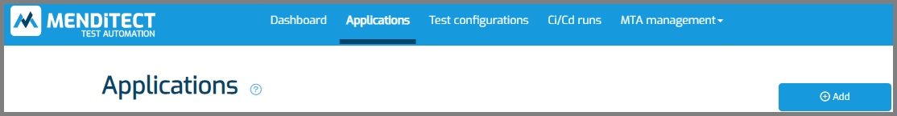
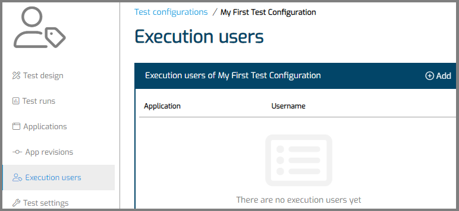
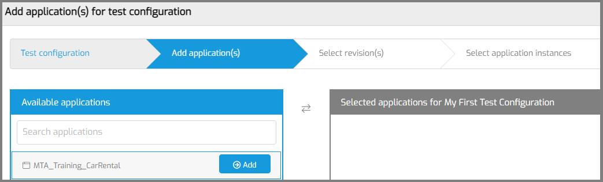
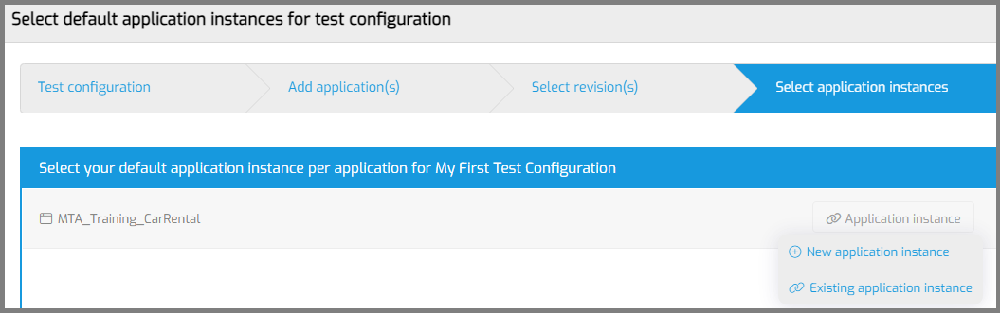

# Run your first test in MTA

These step-by-step instructions will help new MTA users add and execute their first test on a single Mendix App.

## Prerequisites

To go through these steps, you need
- to have access to Mendix App which is published somewhere (Mendix cloud licensed, Sandbox, or other cloud node),
- to know the username of an Account on this Mendix App,
- to have finished the previous 2 walkthroughs: [prepare for using MTA](prepare-for-using-mta) and [access a Mendix model](access-mendix-model).

If you walk through these instructions, you will have 
- registered one of your Mendix Apps in MTA, so you can test it,
- selected an instance (environment) of this Mendix App,  
- registered an existing Account on this instance to be tested with,
- created a simple microflow (unit) test with an assert,
- executed and evaluated this test.

The test will execute a single microflow and check that the return value is not empty.

## 1. Add an Application

Your very first stop is the 'Applications' tab. 

You will start by adding an Application to MTA and adding the username of an account in that Application, so MTA can login with that user to execute your test.
Click on the '+ Application' button to add an Application.

- MTA should show the Mendix projects associated with the given Mendix user for your MTA account.
- Add the application that you want to test from the list.
- Now select the application that you just added.
- Navigate to the 'Execution users' tab.

- Click the '+ Execution user' button.
- Enter the username of the Account you login with in the Test Application, when you normally execute your tests. Don't know what username to enter?  'MxAdmin' will work in most situations.
- Save. 

## 2. Add a Test Configuration

Now navigate to the 'Test settings' tab.
Click on the '+ Test configuration' button to start the wizard for adding a Test Configuration.

The Wizard consists of 4 steps. 

### Step 1

Enter the name and optional description of the Test Configuration. Click 'Save and Next'. 

### Step 2

Selecting the Application under test. Select the Application that you just added to MTA and click 'Next'.

### Step 3

Click the 'Select revision' button. MTA will show a popup. Select the branch and revision that you want to test. Click 'Save and Next'. 

MTA will show a message that it will start downloading this revision.

### Step 4

The last step is selecting an application instance. Click 'Application instance'.

- If you're running your Application under test on the Mendix Cloud, click 'Existing application instance'. You can select any of the application instances MTA has detected when you added the Application.
- If you're running on another cloud provider, on premise, or on a local computer, click 'New application instance'. 

After you have selected an Application instance, you will see the name and UID shown like this:

Save the setup of your Test Configuration.

## 3. Design your test

Use the '...' button on your Test Configuration to show the quick menu and choose 'Test design'.

MTA will show the Test Design page and with your Test Configuration preselected.
- Click the '+ Test suite' button to add a Test Suite to your Test Configuration.
- Give it a name and optional description.
- Save.
- MTA will open the Test Suite.

### Add a Test Case
- Click the '+ Test case' button to add a Test Case to your Test Suite.
- Give it a name.
- Leave the type at 'Automatic'.
- Select the (only) Test application.
- Select the (only) Execution user.
- Save.
- MTA will select the Test Case that you just added.

### Add a Teststep
Next you will choose a microflow to test.
- Click '+ Microflow test'.
- Choose a microflow with a String or Integer/Long return value.  Don't know which microflow to choose? Choose 'Read_enum_mtapluginversion'. 
- MTA will create a teststep for executing the microflow, and teststeps to fill the parameters of the microflow.  Note: you have to create nonpersistable objects yourself. 
- Click <i class="fal fa-ballot-check"></i> and then '+ Assert' to add an Assert.
- Change 'Assert' to "Not equals". This will check that the output is not empty.
- Save.
   

## 4. Execute and evaluate your test

You have two options to execute your test:
1. Click '<i class="fas fa-play"></i> Execute and go to test run overview' to Execute the Test Configuration. 
2. You can also only run your Test Case with the <i class="fas fa-play"></i> button.

After executing:
- Click on 'Details' to view your test results.
- Click on 'Results' to view the test suite run results.
- MTA will open the Test suite run results. This page looks familiar, but is not the same as the page where you configure your Test Suite. You can go back with the '<i class="fas fa-cog"></i> Configure test suite' button.

Did your test pass? Congratulations!  
If not, you can try setting the 'Apply security' to 'Off' on your Test Case.  
Additionally, you may want to read [this page](deal-with-failed-testrun).