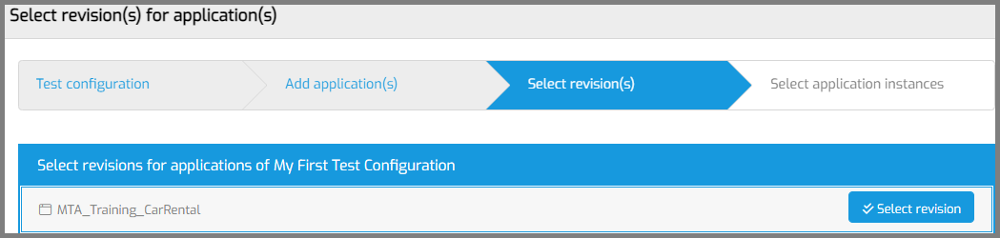
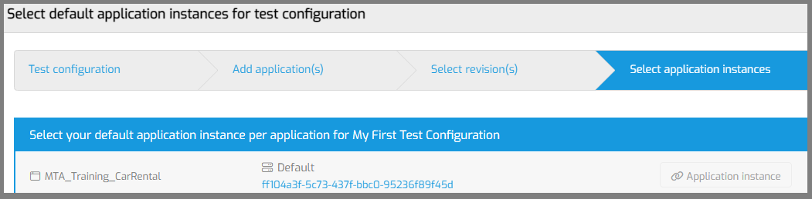

# Run your first test in MTA

These step-by-step instructions will help new MTA users add and execute their first test on a single Mendix App.

## 1. Add an Application

Your very first stop is the 'Applications' tab. 
Click on the '+ Application' button to add an Application.

- Add the application that you want to test from the list.
- Now select the application that you just added.
- Navigate to the 'Execution users' tab.

- Click the '+ Execution user' button.
- Enter the username of the Account you login with in the Test Application, when you normally execute your tests.
- Save. 

## 2. Add a Test Configuration

Now navigate to the 'Test settings' tab.
Click on the '+ Test configuration' button to start the wizard for adding a Test Configuration.

The Wizard consists of 4 steps. 

### Step 1

Enter the name and optional description of the Test Configuration. Click 'Save and Next'. 

### Step 2

Selecting the Application under test. Select the Application that you just added to MTA and click 'Next'.

### Step 3

Click the 'Select revision' button. MTA will show a popup. Select the branch and revision that you want to test. Click 'Save and Next'. 

MTA will show a message that it will start downloading this revision.

### Step 4

The last step is selecting an application instance. Click 'Application instance'.

- If you're running your Application under test on the Mendix Cloud, click 'Existing application instance'. You can select any of the application instances MTA has detected when you added the Application.
- If you're running on another cloud provider, on premise, or on a local computer, click 'New application instance'. 

After you have selected an Application instance, you will see the name and UID shown like this:

Save the setup of your Test Configuration.

## 3. Design your test

Use the '...' button on your Test Configuration to show the quick menu and choose 'Test design'.

MTA will show the Test Design page but with your Test Configuration preselected.
- Click the '+ Test suite' button to add a Test Suite to your Test Configuration.
- Give it a name and optional description.
- Save.
- MTA will open the Test Suite.

### Add a Test Case
- Click the '+ Test case' button to add a Test Case to your Test Suite.
- Give it a name.
- Leave the type at 'Automatic'.
- Select the (only) Test application.
- Select the (only) Execution user.
- Save.
- MTA will select the Test Case that you just added.

### Add a Teststep
- 

## `eof (todo)`