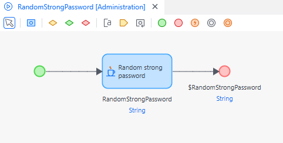

# Use SSO

MTA requires an Execution User for each test case to indicate who is running it. The name of the Execution User should be equal to the username of a local user account. 
When testing with SSO (Single Sign-On), in some cases (for instance, using the SAML 2.0 module) the user is also a local user. This means that, to test with SSO, just enter the local username that is used in the App.

In other cases, the username could be the ID of an SSO user. This ID is a number that can be found in your mendix app when you log in as MxAdmin. Unfortunately, you won't be able to see which user is associated with this ID (but you can see which roles), you can only see this from the IAM application.
If you specify the SSO ID as execution user in MTA the test case will be executed on behalf of that user. 
In this case, we are testing on behalf of an SSO user, but not testing SSO itself. This is currently not supported in MTA.

## Create Accounts on-the-fly

The workaround for using SSO is creating in-app Accounts on-the-fly and removing them after the test has executed.

The pattern to achieve this, is as follows:

Create a Test Configuration with at least 3 Test Suites:
1. Create local Accounts
2. Run tests (in 1 or more Test Suites)
3. Delete local Accounts

At least make sure to put the Delete local Accounts logic in it's own Test Suite, because if a previous Test Suite fails, it will stop executing that one and continue with the next.

### Create local Accounts

The first Test Suite contains one Test Case for each Account that should be created.

Each Test Case uses MxAdmin as the Execution User, and has the Apply Security setting to "No".

Every Test Case in this Test Suite contains these teststeps:
1. [Retrieve](../../Teststep/retrieve) UserRole (1 or more teststep) to determine the Roles for the Account
2. [Create](../../Teststep/create) Account, filling the Name attribute and UserRoles association
3. Determine password (there are several options, read about this below)
5. [Persist](../../Teststep/persist)

The password can be created design-time in teststep 2 by using [MTA's random function on the teststep](../../Teststep/create#generate-random-values). However the downside is that the password is known beforehand, and can theoretically be used to login during execution of the test. A better way is to have the password be created by a microflow at runtime, using the Random Strong Password Java action from the Community Commons module. Such a microflow would look like this:

In this example, the password is not returned as an output parameter and therefore cannot be read in MTA.

### Run tests

The second Test Suite has Test Cases that use the Account(s) created in the first Test Suite as the Execution User, and has the Apply Security setting to "Yes".

### Delete local Accounts

The last Test Suite contains one Test Case that delete the Account(s) that were created in the first Test Suite. It uses MxAdmin as the Execution User, and has the Apply Security setting to "No".

Assuming there are no other Accounts in the database (note that MxAdmin is a *User*, not an *Account*) the simplest way is to just retrieve all Account objects from database, and use Delete + Persist teststeps to wipe them from the database.

## Connectivity tests

MTA can be used to test connectivity by calling an API. The error handling of the API must be given as an output parameter to the microflow otherwise MTA cannot display the possible errors.
If you want to use MTA to periodically poll an interface you will have to create the schedule for this via the CI/CD APIs of MTA. Read more about CI/CD in the How To section.

## Feedback?
Missing anything? [Let us know!](mailto:support@menditect.com)

Last updated 21 april 2022