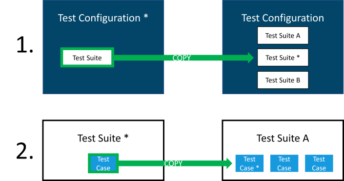

# Transfer a Test Case to another Test Configuration

## Definition

This document describes how to move and store a single Test Case into a 'container' Test Configuration, that is used as a collection of tests, for instance a Test configuration where all the unit tests for a certain Test Application are collected.

First the Test Suite is moved into the collection, then the Test Case is moved into an existing Test Suite.

More in detail:

1. Navigate to the Test Design (home)page and select the Test Configuration containing the draft unit test
2. Use the <i class="fa fa-copy" ></i> button on the Test Suite to copy the Test Suite
3. Expand the "Choose another test configuration, if the test suite should not be copied to the current test configuration:" groupbox, and select the container Test Configuration as target
4. Navigate to the container Test Configuration and open the Test Suite copy
5. Use the <i class="fa fa-copy" ></i> button on the Test Case to copy the Test Case
6. Expand the "Choose another test suite, if the test case should not be copied to the current test suite:" groupbox, and select an existing relevant Test Suite as target
7. Navigate to the Test Design (home)page 
8. Delete the Test Configuration from step 1 using the <i class="fa fa-trash-alt" ></i> button (since the actual intention was to move it, not to copy it)

## Feedback?
Missing anything? [Let us know!](mailto:support@menditect.com)

Last updated 24 may 2022