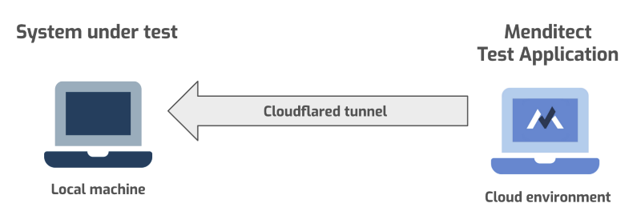

# Test and debug locally

It is possible to have MTA test against a Mendix App running on a developer's computer instead of an app in the cloud. Testing MTA on local environments saves considerable time because app deployment on a cloud environment is time consuming and users that execute tests might interfere with each other.

When running tests on a local machine, be aware that you need to restart your machine in time because the Mendix trial license is shutting down after a couple of hours.

## Architecture for local testing

In order to let MTA communicate with your local environment you need to make your local
application accessible from the internet. This is possible by creating a 'tunnel'. This 'How to'
assumes you use open source CloudFlared software to create one but you can pick another tool of
choice like NGROK.

The CloudFlared software on your local machine generates a URL and publishes that URL to the
CloudFlared server. When messages are sent to this published URL, the Cloudflared server will
redirect that message via the tunnel to the defined port on your local machine.

You need to configure MTA to use this URL for sending commands to the application under test on
your local machine. When you execute a test for a local environment, MTA will fire the request to
CloudFlared which which redirected the request to your local machine. On your local machine the
MTA Plugin is listening to incoming messages and will execute actions on your local Mendix
application.



In order to execute test locally, the following preparations need to be done:

- Setup your local machine.
- Setup the system under test.
- Install and configure a CloudFlared tunnel so the local copy can be accessed by MTA.
- Configure MTA.

## Setup your local machine

- Make sure the computer is connected to the internet, and not behind a proxy or VPN.
- Add 'trycloudflare.com' to the list of trusted sites on your firewall or virus scanner if this is necessary.

## Setup system under test

- Open the Mendix modeler and commit the changes to teamserver.
- Check that you have installed the MTA plugin. If not, follow the procedure as described in [Import MTA Plugin](import-plugin).
- Make sure that a Plugin User exists with the user role MTAPluginUser.
- Navigate to project settings to check the configured runtime port where the CloudFlared tunnel should refer to.


## Configure CloudFlared

- Download and install the CloudFlared tunnel sofware from [https://github.com/cloudflare/cloudflared/releases](https://github.com/cloudflare/cloudflared/releases).
- Execute CloudFlared in an (elevated) command prompt window. Please consult the respective tool documentation to learn the syntax. If you want to create a tunnel for your system under test on local host port 8083 you can use the command:

```
start cloudflared tunnel --url=http://localhost:8083
```

## Configure MTA
In order to test your application locally, you need to have a 'Custom environment' in MTA.

1. Copy the resulting URL that the tunnel software has created to the clipboard (<code>Ctrl+C</code>) .
2. Open MTA.
3. Navigate to the Test Configuration and select the "Test applications" tab.
4. Use the <i class="fa fa-exchange"></i> button to switch environments.
5. Create a new Custom environment, and name it accordingly, for instance "Local [your name]".
6. Paste the URL in the URL box and fill in the Plugin User's credentials.
7. Hit Save; you will now see <i class="fa fa-pencil"></i> button next to the revision number, allowing you to select the revision that you just created.

## Execute tests

Now that your MTA environment can access your local environment, you can execute all tests locally.
Normal test execution assumes that you run the test after you commit your changes to the teamserver and run the app. However, it is possible to execute tests before committing the changes.

**Be aware** that this procedure is not recommended because MTA is not capable of checking the consistency of test definitions with the Mendix model. 

At least these model elements must not have changed when testing an uncommitted model:

- Microflow names;
- Microflow input parameters;
- Microflow output parameters (return value);
- Entity names;
- Entity attributes and data types;
- Enumerations and Constants.

These model elements can have changed without causing problems:
- The content of microflows;
- Anything frontend, like Pages, Widgets, Snippets and Nanoflows;
- Entity access.

## Debugging

It is possible to create breakpoints to debug locally. Or, connect the debugger to a cloud environment. This can be useful to discover where in a Microflow a Test Run failed. Remember that MTA will wait until the app is continued, but the Test Case will stop executing after the set Execution time-out is hit. 

## Feedback?
Missing anything? [Let us know!](mailto:support@menditect.com)

Last updated 24 may 2022