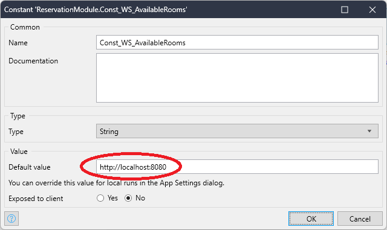
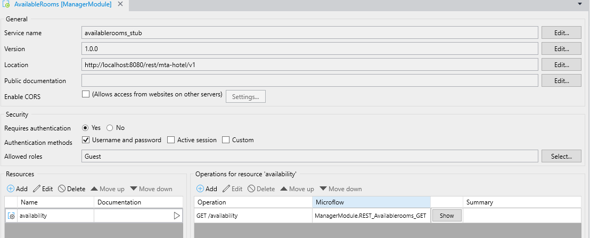

# Test an API

Testing a (REST) API means creating an integration test where two apps communicate. One hypothetical app **(A)** executes a REST call and does something with the result. The other app **(B)** hosts the REST service. 

In MTA it is not possible to directly execute a REST call or host a REST service, but it is possible to call the microflows where the REST call or service depend on. 

## Test both REST service and handling logic

This paragraph describes how to test a microflow in App (A) that connects to a published REST service in App (B).

This microflow that calls the REST service is executed from MTA, and will contain the following elements:
1. input parameters being used in the REST call;
2. a create variable action where the URL to the API is constructed;
3. the REST call that outputs a JSON string;
4. executing the submicroflow containing any custom logic;
5. optionally any output parameters to be used in following test steps in MTA.

Finally, add the teststeps in MTA:
- a microflow teststep with the necessary parameters;
- a retrieve object teststep, with the output of the first teststep, containing an assert (either on object count, or on attribute, depending on the expected result).

## Test logic by calling a stubbed REST service

If testing the REST service is not so much the goal, rather than testing if the expected result is handled correctly, it is useful to build a stub. 

Prerequisite for using a stubbed REST service, is that the URL to the REST service is contained within a Constant.

As shown the Constant defaults to the localhost. The stubbed REST service is indeed part of the App itself:

The stub REST service microflow (highlighted in the image) will always return the same result.

To use the stub, simply do not change the value of the Constant when running the App. 
To use a production REST service, set the value of the Constant when deploying.

## Test logic without calling a REST service

Alternatively, it is possible to test only the microflow (4) that handles the result of the REST call.

To achieve this, add a microflow teststep in MTA and manually enter a value for the input parameter (JSON string).

## Test a published REST service 

To test the App that hosts the REST service **(B)**, the microflow is executed that is part of the REST operation. 
To find this microflow, open the Published REST service in Mendix Studio Pro en select Show for that REST operation:

This microflow will contain the same input parameter data as the microflow executing the REST call for app **(A)**, but the parameters are typed. For example:

The output of this microflow is an httpresponse.

Finally the steps in MTA to test are:
1. execute above microflow with the necessary parameters;
2. retrieve object, with the output of test step 1 (httpresponse), and one or more asserts on the attributes of the httpresponse, for example “StatusCode = 200”.

## Feedback?
Missing anything? [Let us know!](mailto:support@menditect.com)

Last updated 26 june 2023