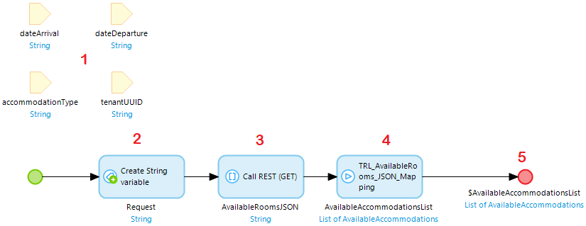

# Test an API

Testing a (REST) API means creating an integration test where two apps communicate. One hypothetical app **(A)** executes a REST call and does something with the result. The other app **(B)** hosts the REST service. 

In MTA it is not possible to directly execute a REST call or host a REST service, but it is possible to call the microflows where the REST call or service depend on. 

## Test both REST service and handling logic

This paragraph describes how to test a microflow in App (A) that connects to a published REST service in App (B).

This microflow that calls the REST service is executed from MTA, and will contain the following elements:
1. input parameters being used in the REST call;
2. a create variable action where the URL to the API is constructed;
3. the REST call that outputs a JSON string;
4. executing the submicroflow containing any custom logic;
5. optionally any output parameters to be used in following test steps in MTA.

Finally, add the teststeps in MTA:
- a microflow teststep with the necessary parameters;
- a retrieve object teststep, with the output of the first teststep, containing an assert (either on object count, or on attribute, depending on the expected result).

## Stub a REST API for Unit testing

There are some options to use stubbing an API, to bypass the actual REST service. The first option is the simplest but allows no flexibility. The second and third options work best in conjunction with MTA. These options require downloading a seperate [Api Stub module](https://marketplace.mendix.com/link/component/212962) from the Mendix Marketplace. 

### OPTION 1 - Fixed response

Characteristics: simple, fixed response, no variations, useful if your App has only a single integration with a external API.

1. isolate your REST call action in a microflow and make it return the JSON Response, like this: 

2. create (if not yet exists) a Constant where you can store if the current environment is a Production environment, like this: 

3. use the value of the Constant in a Decision to either call the REST API or return a stubbed JSON string, like this: 

### OPTION 2 - Variable response

Characteristics: include variation in your stubbed JSON string, useful in situations with multiple integrations. 

There is an example microflow included in the module for this option.

1. Download the [Menditect Api Stub module for Unit Testing](https://marketplace.mendix.com/link/component/212962) from the Marketplace. You already need to have the CommunityCommons module in your project.
2. Set the Const_Environment to 'T' for testing, 'P' for Production.
3. Include the Snippet_Configure in a page to allow configuring your stubbed JSON string per REST call.
4. Deploy to your environment. Open the configuration page. Look for REST calls in your project that you want to test, include a unique Key and stubbed JSON for each one.  
5. In the microflows calling REST services, instead of using a String variable like in OPTION 1, call the GET_stub_by_key microflow. 
6. Place the Key that you also used when configuring in step 4.
7. The result should look like this: 

### OPTION 3 - Stubbed REST service

Characteristics: replace the actual REST service by a stubbed REST service published in the test application, useful if performance metrics should be included in the test. 

There is an example microflow included in the module for this option.

1. Download the [Menditect Api Stub module for Unit Testing](https://marketplace.mendix.com/link/component/212962) from the Marketplace. You already need to have the CommunityCommons module in your project.
2. Set the Const_Environment to 'T' for testing, 'P' for Production.
3. Include the Snippet_Configure in a page to allow configuring your stubbed JSON string per REST call.
4. Deploy to your environment. Open the configuration page. Look for REST calls in your project that you want to test, include a unique Key and stubbed JSON for each one.  
5. In the microflows calling REST services, place an action that calls the API_get_URL_and_activate microflow before each REST call.
6. Place the Key that you also used when configuring in step 4.
7. Cut the Location string from the REST call action and paste it into the ProductionURL parameter.
8. The microflow could throw an Exception. Place an error handler that shows the error message. 
9. The result should look like this: 

### Using MTA to set stubbed JSON instead of the configuration page

You can perform the configuration in steps 4 for options 2 and 3 in MTA, instead of in a configuration page in the test app. 

The best way is to create a [Test Case](../../test-case) that creates the configuration objects and uses Test Case [Datavariation](../../datavariation) to allow for the variation of the stubbed JSON string:

## Test logic without calling a REST service

Alternatively, it is possible to test only the microflow (4) that handles the result of the REST call.

To achieve this, add a microflow teststep in MTA and manually enter a value for the input parameter (JSON string).

## Test a published REST service 

To test the App that hosts the REST service **(B)**, the microflow is executed that is part of the REST operation. 
To find this microflow, open the Published REST service in Mendix Studio Pro en select Show for that REST operation:

This microflow will contain the same input parameter data as the microflow executing the REST call for app **(A)**, but the parameters are typed. For example:

The output of this microflow is an httpresponse.

Finally the steps in MTA to test are:
1. execute above microflow with the necessary parameters;
2. retrieve object, with the output of test step 1 (httpresponse), and one or more asserts on the attributes of the httpresponse, for example “StatusCode = 200”.

## Feedback?
Missing anything? [Let us know!](mailto:support@menditect.com)

Last updated 26 june 2023