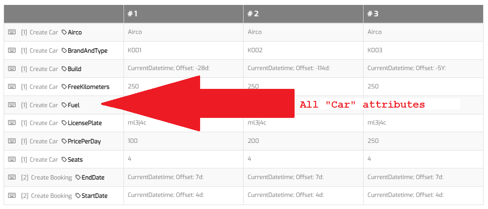
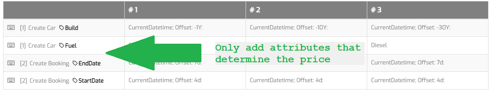
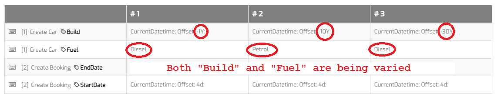
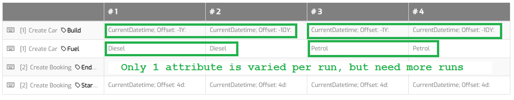

# Data variation 

## Add only relevant attributes

Only add relevant attributes to datavariation. Attributes that have the same value for all variations can be specified in the test case. This keeps the datavariation pages clean.

### Wrong:

Consider the situation of booking a rental car, where the booking price is determined by only a couple attribute's values.

### Right:

## Vary with only one value

Only change a single attribute value per variation. Add more variations if you need to cover more situations. If you get an unexpected test run result, you will know which attribute caused it.

### Wrong:

Consider the situation of booking a rental car, where the booking price is determined by only a couple attribute's values.

### Right:

## Feedback?
Missing anything? [Let us know!](mailto:support@menditect.com)

Last updated 1 March 2024