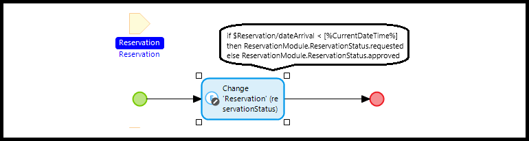

# Testability

## Make your Mendix model testable

### Build microflows as a unit

A microflow behaves as a unit, whenever it has few submicroflows, is not too complex, does not have more than 10 end events, has a dedicated function and does not rely on the database too much.

Additionally, a microflow is more unit testable when it has only explicit in- and output:

### Build microflow as a process

A microflow behaves as a process, whenever it calls submicroflows to perform actions, uses data from and saves data to the database and calls external modules or systems that it depends on.

Build microflows with process testing in mind: splitup governing microflows into submicroflows, provide an object as output parameter if used in a show page action and keep database retrieves and commits separated from business logic. 

### Follow Mendix best practices

https://docs.mendix.com/refguide/dev-best-practices/

### Base Microflow names on Entity names

For example
- ACT_Car_Save
- ACT_Insurance_Create
- SUB_Customer_Check_Address
- CAL_Invoice_Price

### Keep your domain model readable

- Avoid association lines crossing as much as possible.
- Move parent entities to the top, child entities to the bottom.
- Keep non-persistable entities separate.
- Move entities into their own module if the amount of attributes and associations keeps growing.

### Avoid if/else constructions in microflow actions

Instead of doing this:

Do this:

### Other tips and tricks

- Avoid microflow logic duplication.
- Avoid start- and stop transaction actions.
- Use annotations for complex microflows or when differing from Mendix practices.
- Have coworkers peer review your code.
- Avoid Java actions in microflows. 
- Plan refactoring time. 
- Consider using test driven development to reduce refactoring time.

## Feedback?
Missing anything? [Let us know!](mailto:support@menditect.com)

Last updated 1 March 2024