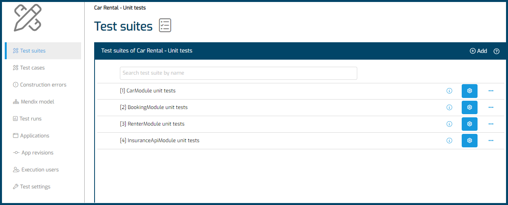
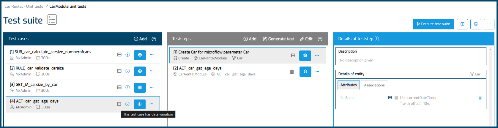

# Unit testing

## Definition

A unit test in MTA is a test that executes a single microflow, and creates the necessary data in order to do so. 

Menditect advises to start with building Unit tests when introducing Menditect Test Automation, given it's characteristics.

## Characteristics

- A unit test is executed on a single Mendix App, in a single session by a single user.
- A unit test is quick to build into MTA and thus a good way to get to know MTA.
- A unit test is a direct prove that your code works.
- A unit test provides immediate time savings.
- If defects are found with unit tests, this is a signal that defects will also exist at the process level, and these defects can be solved faster than if they were found with a process test.
- A unit test generally does not leave traces in the Mendix app being tested, which means the result cannot be visually inspected there.

## Structure

Maintaining unit tests will have a different frequency than maintaining process tests. Therefore it is recommended to use below structure in MTA:

- One test configuration per Mendix application, for all unit tests, and only for unit tests.
- One test suite per Mendix model module.

- One test case per microflow to be tested.
- Data variation on the test case level to reach higher test coverage for each microflow to be tested.

## Tips and tricks

- Have unit tests created, executed and maintained by **the same Mendix developer** that created the microflow.
- Start building unit tests of **validation flows, rules and calculation microflows**.
- Build a unit test **for every defect found**.
- During product refinement, determine whether a feature is **unit testable**.
- **Test without security** on the [Test Case](../../mta/test-case#properties).
- **Test using rollback** on the [Test Case](../../mta/test-case#properties).
- Use MTA's **test generation by microflow** feature as a starting point.
- **Prevent reliance on the database.** Do not retrieve objects from database, and do not commit objects to database.
- **Include asserts** to have MTA check the results automatically instead of manually inspecting them. 
- **Use datavariation on relevant attributes**, to achieve higher test coverage. 

## Feedback?
Missing anything? [Let us know!](mailto:support@menditect.com)

Last updated 1 March 2024