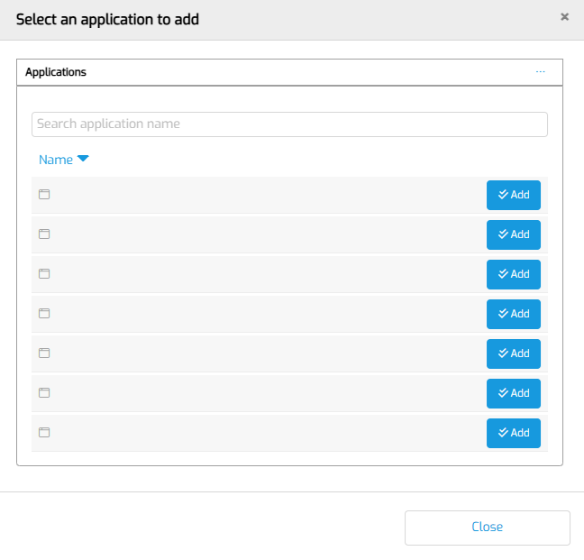

# Empty App names

## Issue summary

In the list of Apps that you can Add to MTA, the names are suddenly empty.

If you click Add on one of them, you get an error.

## Possible causes and resolutions

This is a known issue related to a datasource microflow that is not correctly handled. It will be fixed in a future release. If you see this please close and reopen this popup.