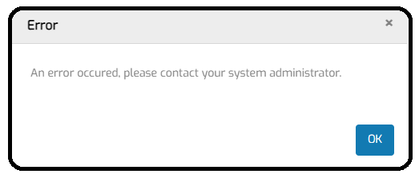

# Generic random error message

## Issue summary

While navigating through MTA, a "generic" error message is sometimes shown. The occurence may feel random.

The message could look like this: 

 

If this generic message is shown only once while navigating, and does not come back when after you retry the same action, it is nothing to worry about.

The cause is that the interface between the browser and the Mendix server did not respond in time because too much data was being processed. 

#### Resolutions

Processing large amounts of data in MTA becomes troublesome when running MTA on an instance which resources are inadequate. The solution is to buy more resources for your cloud node. 

For Mendix resource packs, see https://docs.mendix.com/developerportal/deploy/mendix-cloud-deploy/#resource-pack. When using MTA intensively with more than 2 users, an M21 resource pack or larger is recommended.

