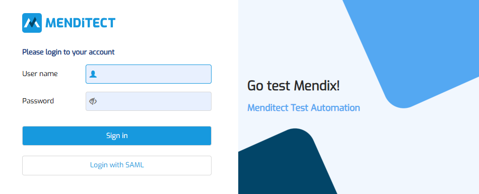

# Session suddenly closed

## Issue summary

While working in MTA, the end user is redirected to the login page. 

It seems like the session was closed. 

## Possible causes and resolutions

The **Back button** was used in the browser (or on the mouse).

Because Pages in MTA are not stacked but always closed before opening a new one, using the Back button will sometimes redirect the end user to the login page. The session is actually still active, navigating to the base App URL will show the MTA home page and continue the current session.

While working in a Test Configuration, use the breadcrumbs or menu items to navigate back, not the Back button.