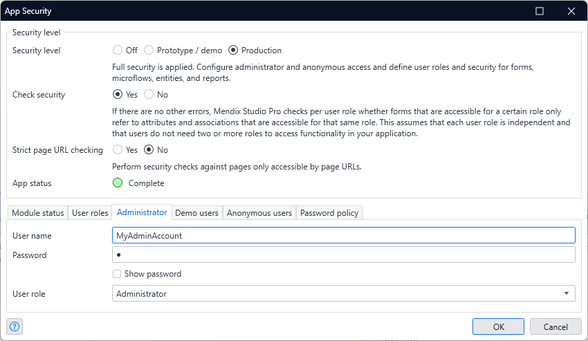

# Admin User does not Exist

## Issue summary

When Running a Test with the primary Administrator account as the Execution User, the Test fails.

## Possible causes and resolutions

### Primary Administrator User name was changed

The User name of the Administrator account that is configured in the Security page of the Mendix Model is `MxAdmin` by default.

If this User name is changed, every Test executed with `MxAdmin` will fail, but also, **every Test executed under the customized User name will fail.**

We are currently investigating why the customized primary Administrator account is not recognized. 

### Resolutions

Choose any of below.

- Create another Administrator Account on the Application Instance where the Test is executed.
- Change the Account name back to "MxAdmin".