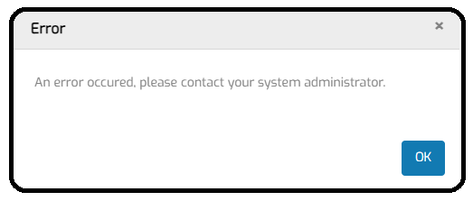

# Generic random error message

## Issue summary

While navigating through MTA, a "generic" error message is sometimes shown. The occurence may feel random.

The message could look like this: 

 

In most cases, if the page is loading correctly, this is nothing to worry about. It may be due to the Mendix XAS interface being temporarily unresponsive.

However, if you are having doubts: when this error is shown, please use Development Tools / Console (keyboard shortcut `Ctrl` + `Shift` + `i`) to verify the origin of the error message. You can make a screenshot of this Console window and share it with us, by contacting support (support@menditect.com).

