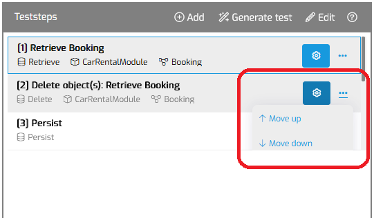
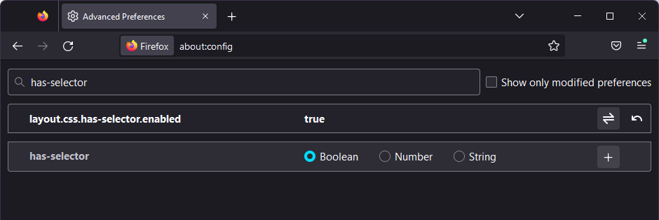

# Popup Menu is cut off in Firefox 

## Issue summary

The Popup Menu that is used since MTA 2.0 is not shown correctly when using Firefox.

MTA will notify users with a red button of this issue after they login. Clicking the button will lead them to the solution described below.

## Possible causes and resolutions

This popup menu is using the `has` selector in CSS.
This feature is enabled by default in Chromium browsers, and disabled by default in Firefox.
Most other browsers do not support the feature.

To enable the feature in **Firefox**: 
- navigate to `about:config` in your Address bar
- search for `has-selector` like this:
 
- then, make sure to set the `layout.css.has-selector.enabled` property to **true**.
- restart Firefox and go to MTA to check the menu is working correctly.

More documentation about the `has` selector on Mozilla: https://developer.mozilla.org/en-US/docs/Web/CSS/:has