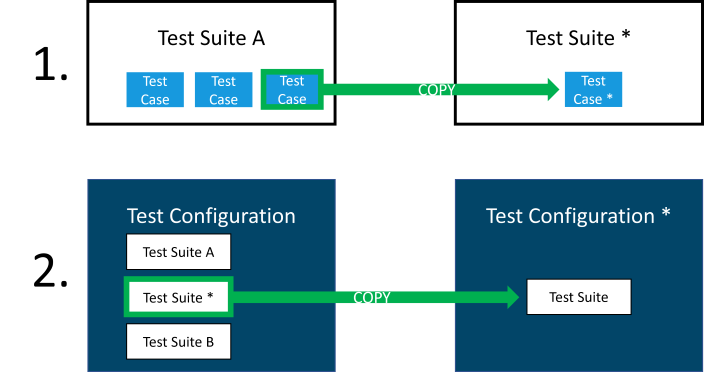

# Isolate a Test Case

## Definition

This document describes how to isolate or extract a single Test Case.

<i class="fa fa-exclamation-triangle"></i>  From MTA version 1.7 if you want to Run a single Test Case it is no longer necessary to isolate it.  
To isolate a single test case, copy it into an empty Test Suite, in another Test Configuration, containing only that Test Suite.

More in detail:

1. Edit the Test Case in MTA that needs to be single-tested using the <i class="fa fa-pencil" ></i> button;
2. Note the Test application that is selected for the Test Case;
3. Navigate to the Test Design (home)page;
4. Create a Test Configuration, and add the Test application that was noted in step 2;
5. Navigate back to the Test Configuration that contains the Test Case to be single-tested;
6. Create a Test Suite in this Test Configuration;
7. Navigate back to the Test Suite that contains the Test Case to be single-tested;
8. Select that Test Case;
9. Use the <i class="fa fa-copy" ></i> button on the Test Case to copy the Test Case;
10. Expand the "Choose another test suite, if the test case should not be copied to the current test suite:" groupbox, and select the Test Suite that was created in step 6 as target;
11. Navigate back to the Test Configuration (tip: use the breadcrumb feature on top of the Test Cases list, and click on "Test design overview");
12. Move the mouse over the Test Suite containing the single Test Case, to make the action buttons visible;
13. Use the <i class="fa fa-copy" ></i> button on the Test Suite to copy the Test Suite;
14. Expand the "Choose another test configuration, if the test suite should not be copied to the current test configuration:" groupbox, and select the empty Test Configuration that was created in step 4 as target;
15. Delete the Test Suite that was created in step 6 using the <i class="fa fa-trash-alt" ></i> button (since the actual intention was to move it, not to copy it);

## Feedback?
Missing anything? [Let us know!](mailto:support@menditect.com)

Last updated 12 july 2022