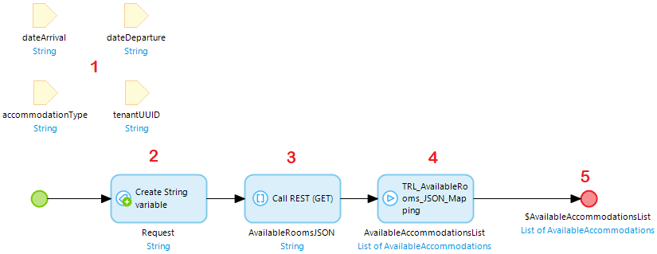
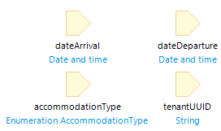

# Test an API

Testing an API means creating an integration test where two apps communicate. One hypothetical app **(A)** executes a REST call. The other app **(B)** hosting a REST service, will answer. In MTA it is not possible to directly execute a REST call or host a REST service, but it is possible to use the microflows where the REST call or service depends on. 

## Test a REST call 

To test app **(A)**, a microflow that performs the REST call can be used. This microflow is executed from MTA, and will contain the following elements:
1. input parameters being used in the REST call;
2. a create variable action where the URL to the API is constructed;
3. the REST call, yielding a JSON string;
4. executing the submicroflow containing any custom logic;
5. optionally any output parameters to be used in following test steps in MTA.

Alternatively, only the submicroflow containing the logic could be used for unit testing. This means however the JSON string must be manually entered in MTA, using a Create Object test step.

Finally the steps in MTA to test are:
execute above microflow with the necessary parameters;
a retrieve object, with the output of test step 1, containing an assert (either on object count, or on attribute, depending on the expected result).

## Test a published REST service 

To test app **(B)**, the microflow is executed that is part of the REST operation. 
To find this microflow, open the Published REST service in Mendix Studio Pro en select Show for that REST operation:

This microflow will contain the same input parameter data as the microflow executing the REST call for app **(A)**, but the parameters are typed. For example:

The output of this microflow is an httpresponse.

Finally the steps in MTA to test are:
1. execute above microflow with the necessary parameters;
2. retrieve object, with the output of test step 1 (httpresponse), and one or more asserts on the attributes of the httpresponse, for example “StatusCode = 200”.

## Feedback?
Missing anything? [Let us know!](mailto:support@menditect.com)

Last updated 21 april 2022