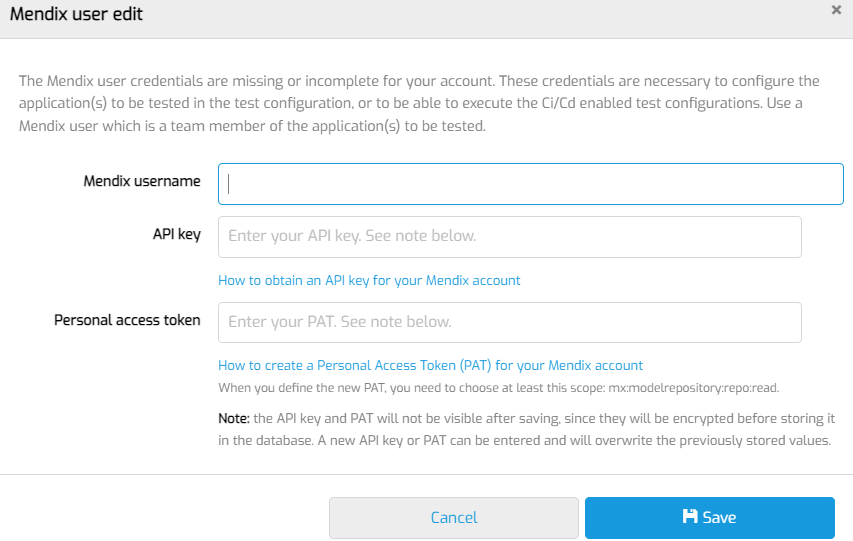

# Access Mendix model

To access Mendix projects, the user who logs in to MTA must be linked to a Mendix user.

- First, login to MTA using the credentials provided by Menditect.
- Click the user icon on the top right 
- Fill in these fields under Mendix credentials:  
- The Mendix account username;
- An API key created for this Mendix profile.
- Click Save.

To test if the link works, add a new Test Application. The Mendix projects should be visible.