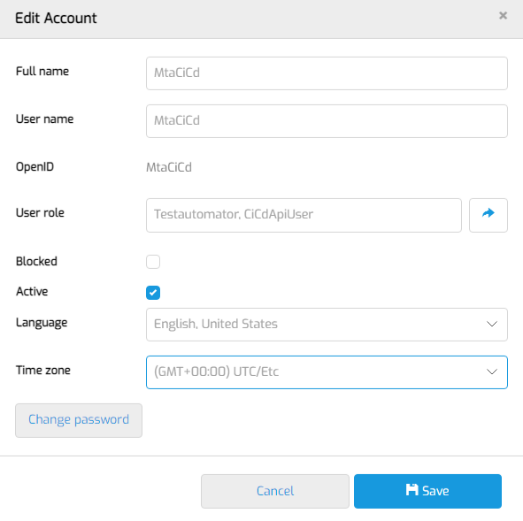

# Ci/Cd configuration

## Definition

This document describes the guidelines to use the CiCd api of MTA in a pipeline.

## How to prepare MTA
In order to prepare MTA for integration with your Ci/Cd pipeline you need to create a user in MTA with only the Testautomator and CiCdApiUser roles:



This is the username and password you will connect with to the API. 

## How to include a Test configuration in Ci/Cd
Where regular test runs are executed on the Test Configuration level, Ci/Cd enabled test runs are executed on the Test Application level. When testing a Test Application, all Test Configurations that are Ci/Cd enabled, are executed.

If you want to include a Test configuration in testing, you need to enable it by editing it from the Test design page. 
Edit the respective test configuration and set "Ci/Cd enabled" to TRUE.

## How to execute a testrun from Ci/Cd

The base URL for the Ci/Cd API is:
```
{your mta node}/rest/cicdservice/v1/CiCd/
```

The Ci/Cd API knows two REST requests. 
1. POST testruns <br/> This request executes a new Ci/Cd testrun
2. GET testrunsresult <br/> This request returns the result for a previously executed Ci/Cd testrun

The contents of these requests are described next.

### POST testruns
**URL**

`/rest/cicdservice/v1/CiCd/testruns`

*Example: https://mta-menditect-9fo2p/rest/cicdservice/v1/CiCd/testruns*

**Authorization**

| Authorization | Basic |
| ----------- | ----------- |
| Username: | `{the CiCd username in MTA}` |
| Password: | `{the CiCd password in MTA}`|

**Input body**

| Parameter |   |
| ----------- | ----------- |
| ProjectId | `{the Mendix project ID for the Mendix App you want to execute, which can be found under the Applications page in MTA}` |
| EnvironmentName | `{the exact name of the application environment you want to test on}` |
| EnvironmentType | `{either “Custom” or “MendixCloud”}` |

*Example:* 

```
{
   "ProjectId":"fb9e16d9-05ea-42fc-91a6-41c5b2341384",
   "EnvironmentName": "Lokaal Niels",
   "EnvironmentType": "Custom"
}
```

**Output (if http response = 200/OK)**

| Parameter |   |
| ----------- | ----------- |
| ExecutionId | `{an incremented integer representing an ID for the created CiCd testrun}` |

*Example: {"ExecutionId":123}*


### GET testrunsresult
**URL**

`/rest/cicdservice/v1/CiCd/testrunsresult`

*Example: https://mta-menditect-9fo2p/rest/cicdservice/v1/CiCd/testrunsresult*

**Authorization**

| Authorization | Basic |
| ----------- | ----------- |
| Username: | `{the CiCd username in MTA}` |
| Password: | `{the CiCd password in MTA}`|

**Input parameters**

| Parameter |   |
| ----------- | ----------- |
| ExecutionId | `{the ID for a previously created CiCd testrun}` |

*Example: https://mta-menditect-9fo2p/rest/cicdservice/v1/CiCd/testrunsresult?ExecutionId=123*

**Output (if http response = 200/OK)**

| Parameter |   |
| ----------- | ----------- |
| Result | `{either "Pass" or "Fail"}` |

*Example: {"Result":"Pass"}*

## How to view results of a Ci/Cd testrun 
To view the detailed results of a testrun that is executed from CiCd, login on MTA, and go to the “Test run”/”Ci/Cd test runs (beta)” page. All the executed CiCd testruns are listed here with their respective Execution Id, also the ones that were not successful. 
Using the Details button it is possible to view the results of the testrun.

Note that CiCd testruns are also listed on the Test Run overview page, recognizable by the infinity ∞ icon. 
Go to [Test run](../definitions/test-run) for more information about test runs.

## Testrun cleanup
Currently, every night a scheduled event cleans up Ci/Cd test runs. MTA only persists Ci/Cd test runs associated with the last two executions for a single test application. 