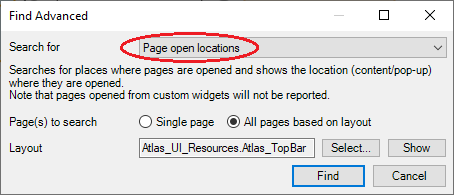

# Prepare Mendix project

To prepare the Mendix project for MTA, it is advisable to check for microflows that open a page. If you want to test a microflow that opens a page, you must include an output parameter in that microflow, returning the exact same object that is passed to the page.

To find all microflows that have a “show page” activity, open Mendix Studio Progo to Edit→ Find Advanced and select the following options:  

Choose an optional layout that is used in the project and Mendix will give you a list of “find results”. Filter the find results by only showing results of the type “microflows”. Check all the microflows of the “find results” and add return types for microflows you want to include in testing. Repeat this for all page layouts in use. This process will save you a lot of time if completed before configuring MTA.

A few notes:

- Only follow these steps for the microflows that you actually want to test
- If pages are called without an input object, no changes are needed